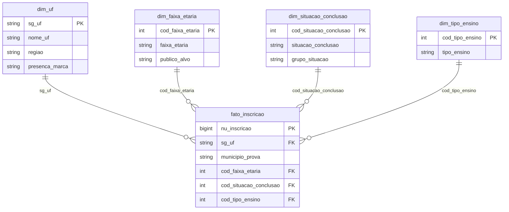
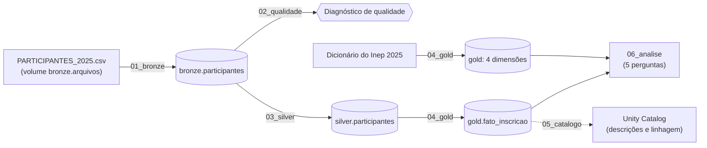

# MVP – Engenharia de Dados

### Mapeando o público do Enem para a divulgação das lives de correção das provas por um grupo educacional

**Aluna:** Rosana Ramos de Sousa  
**Curso:** Pós-Graduação em Ciência de Dados e Analytics – PUC-Rio  
**Sprint:** Engenharia de Dados (40530010057_20260_01)  
**Plataforma:** Databricks Free Edition

---

## Sumário

- [Resumo](#resumo)
- [1. Contexto de Negócios e Perguntas (Etapa 2 e 4.1)](#1-contexto-de-negócios-e-perguntas-etapa-2-e-41)
  - [1.1 Contextualização e objetivos gerais](#11-contextualização-e-objetivos-gerais)
  - [1.2 Perguntas de negócio](#12-perguntas-de-negócio)
  - [1.3 Dados selecionados](#13-dados-selecionados)
- [2. Carga dos Dados (Etapa 4.2)](#2-carga-dos-dados-etapa-42)
- [3. Modelagem e Catálogo de Dados (Etapa 4.3)](#3-modelagem-e-catálogo-de-dados-etapa-43)
  - [3.1 Arquitetura medalhão](#31-arquitetura-medalhão)
  - [3.2 Modelo estrela (camada gold)](#32-modelo-estrela-camada-gold)
  - [3.3 Catálogo de dados](#33-catálogo-de-dados)
- [4. Pipeline de Dados (Etapa 4.4)](#4-pipeline-de-dados-etapa-44)
  - [4.1 Transformações da camada silver](#41-transformações-da-camada-silver)
  - [4.2 Transformações da camada gold](#42-transformações-da-camada-gold)
- [5. Qualidade de Dados (Etapa 4.5)](#5-qualidade-de-dados-etapa-45)
- [6. Análise de Dados (Etapa 4.5)](#6-análise-de-dados-etapa-45)
  - [6.1 Pergunta 1: estados e municípios prioritários](#61-pergunta-1-quais-estados-e-municípios-de-prova-concentram-mais-inscritos-além-de-bahia-e-minas-gerais-e-devem-ser-priorizados-no-esforço-de-mídia)
  - [6.2 Pergunta 2: peso do público de 16 a 20 anos](#62-pergunta-2-o-público-de-16-a-20-anos-representa-de-fato-mais-da-metade-dos-inscritos-se-não-quais-faixas-etárias-deveriam-entrar-na-estratégia)
  - [6.3 Pergunta 3: volume de inscritos × proporção de jovens](#63-pergunta-3-os-estados-com-mais-inscritos-são-também-os-que-têm-a-maior-proporção-de-jovens-de-16-a-20-anos-ou-a-priorização-de-mercados-muda-quando-olhamos-só-para-o-público-alvo)
  - [6.4 Pergunta 4: situação de conclusão do ensino médio](#64-pergunta-4-a-maior-parte-dos-inscritos-ainda-está-cursando-o-ensino-médio-como-pressupõe-a-estratégia-ou-há-uma-parcela-relevante-que-já-concluiu-e-é-público-potencial-de-cursinho)
  - [6.5 Pergunta 5: tipo de escola](#65-pergunta-5-a-maioria-dos-inscritos-vem-de-escola-pública-o-que-isso-indica-para-o-tom-da-comunicação)
  - [6.6 O que os dados dizem à campanha](#66-o-que-os-dados-dizem-à-campanha)
- [7. Considerações finais e Autoavaliação](#7-considerações-finais-e-autoavaliação)
  - [7.1 Atingimento dos objetivos](#71-atingimento-dos-objetivos)
  - [7.2 Pontos de melhoria](#72-pontos-de-melhoria)
  - [7.3 Autoavaliação](#73-autoavaliação)
- [Referências](#referências)

---

## Resumo

Este projeto consiste na construção de um pipeline de dados na nuvem para apoiar o planejamento de mídia de uma campanha nacional: a divulgação das lives de correção das provas do Enem 2026 por um grupo educacional. A partir dos microdados do Enem 2025, publicados pelo Inep, os dados foram carregados no Databricks, organizados em arquitetura medalhão (bronze, silver e gold), modelados em esquema estrela, documentados no Unity Catalog e analisados com SQL para responder a cinco perguntas de negócio sobre o perfil e a distribuição geográfica do público.

---

## 1. Contexto de Negócios e Perguntas (Etapa 2 e 4.1)

### 1.1 Contextualização e objetivos gerais

#### O Enem

O Enem é a principal porta de entrada para o ensino superior no Brasil. Em 2026, segundo o balanço preliminar do MEC/Inep de julho, há mais de 5 milhões de inscritos confirmados (5.055.818), uma alta de 5,08% em relação a 2025. É a maior edição dos últimos anos, com crescimento de 48,8% em relação a 2022. Em 2026, as provas serão aplicadas em 8 e 15 de novembro.

#### Sobre o grupo educacional e a campanha

O grupo é consolidado, com mais de 26 anos, e atua no segmento de educação escolar (educação infantil e ensino médio) e cursos pré-vestibular em Belo Horizonte e Salvador, além de ter o seu sistema de ensino adotado por escolas parceiras em diferentes regiões do Brasil. Com o objetivo de se tornar a maior referência nacional no Enem, a marca busca realizar, em 2026, a maior live de correção do exame do Brasil.

A estratégia é que a divulgação aconteça em redes sociais, influenciadores, branded content com grandes portais, TikTok, YouTube (canal das lives), ambientes de lives de games, ChatGPT e Uber Ads, este último com uma estratégia de impacto no trajeto casa → local de prova, na ida e na volta. A definição dos canais tem como base pesquisas de mercado sobre o comportamento de consumo de mídia dos públicos entre 16 e 20 anos que estão no ensino médio ou em cursinhos pré-vestibular, já analisadas pelo grupo.

Além da análise dos dados de canais de mídia já realizada pelo time de marketing e mídia, faz-se necessário o entendimento do perfil e da distribuição geográfica dos inscritos no Enem 2025, a fim de identificar em quais estados e municípios vale concentrar o esforço de mídia e de orientar a escolha de canais e do tom de comunicação de cada público, fazendo com que a comunicação aconteça de forma assertiva.

> **Observação:** para esta análise, foram utilizados os microdados de 2025, já que os microdados de 2026 só serão publicados após a realização das provas. De todo modo, são os dados mais recentes e trazem o cenário real do perfil de público do exame.

### 1.2 Perguntas de negócio

Com base nesse contexto, foram definidas perguntas que testam as hipóteses do grupo sobre o seu público e indicam onde concentrar o esforço de divulgação:

1. Quais estados e municípios de prova concentram mais inscritos, além de Bahia e Minas Gerais, e devem ser priorizados no esforço de mídia?
2. O público considerado prioritário pelo grupo, de 16 a 20 anos, representa de fato a maior parte (mais da metade) dos inscritos? Se não, quais faixas etárias deveriam entrar na estratégia?
3. Os estados com mais inscritos são também os que têm a maior proporção de jovens de 16 a 20 anos, ou a priorização de mercados muda quando olhamos só para o público-alvo?
4. A maior parte dos inscritos ainda está cursando o ensino médio, como pressupõe a estratégia, ou há uma parcela relevante que já concluiu e é público potencial de cursinho?
5. A maioria dos inscritos vem de escola pública? O que isso indica para o tom da comunicação?

### 1.3 Dados selecionados

#### Fonte dos dados

Os dados utilizados são os **Microdados do Enem 2025**, publicados pelo Inep (Instituto Nacional de Estudos e Pesquisas Educacionais Anísio Teixeira) e disponíveis para download público em: https://www.gov.br/inep/pt-br/acesso-a-informacao/dados-abertos/microdados/enem

A pasta do Enem 2025 traz dois arquivos principais: `PARTICIPANTES_2025.csv`, com o perfil dos inscritos, e `RESULTADOS_2025.csv`, com as notas. Como o objetivo deste estudo é entender o perfil e a distribuição geográfica do público, foi utilizado apenas o arquivo de participantes. O conjunto de informações baixado também traz o dicionário de variáveis, usado como referência para os códigos de cada coluna.

#### Estrutura dos dados brutos

O arquivo `PARTICIPANTES_2025.csv` (489,34 MB) possui **4.810.772 linhas**, uma por inscrito, e **39 colunas**, separadas por ponto e vírgula e codificadas em ISO-8859-1 (latin-1). Para este estudo, foram selecionadas 6 colunas:

| Coluna | Tipo | Descrição | Uso |
|---|---|---|---|
| NU_INSCRICAO | bigint | Número de inscrição anonimizado | Verificar duplicatas |
| SG_UF_PROVA | string | UF de aplicação da prova | Perguntas 1 e 3 |
| NO_MUNICIPIO_PROVA | string | Município de aplicação da prova | Pergunta 1 |
| TP_FAIXA_ETARIA | int | Faixa etária do inscrito (código de 1 a 20) | Perguntas 2 e 3 |
| TP_ST_CONCLUSAO | int | Situação de conclusão do ensino médio (código de 1 a 4) | Pergunta 4 |
| TP_ENSINO | int | Tipo de instituição em que concluiu ou concluirá o ensino médio (código 1 ou 2) | Pergunta 5 (aproximação) |

*Tabela 1 – Colunas dos dados brutos selecionadas para o estudo.*

Esse arquivo descreve quem se **inscreveu** no exame, e não quem compareceu às provas. Por isso, ao longo do trabalho, o termo utilizado é "inscritos".

#### Anonimização e LGPD

Para atender à Lei Geral de Proteção de Dados Pessoais (LGPD, Lei nº 13.709/2018), o Inep divulga os microdados em um formato que impede a identificação de pessoas, validado pela Autoridade Nacional de Proteção de Dados (ANPD).

#### Licença

Os microdados são disponibilizados gratuitamente na seção de Dados Abertos do portal do Inep. Por serem dados abertos do governo federal, seguem o Decreto nº 8.777/2016, que prevê a sua disponibilização sob licença aberta, permitindo a livre utilização, o consumo e o cruzamento dos dados, com a única exigência de creditar a autoria ou a fonte. Neste trabalho, os dados originais não são redistribuídos: o repositório contém apenas o código do pipeline e resultados agregados, com a citação do Inep como fonte. Trata-se de um estudo acadêmico, que aplica dados públicos a um cenário de negócio.

---

## 2. Carga dos Dados (Etapa 4.2)

A carga seguiu o "caso simples" descrito no enunciado: o pacote `microdados_enem_2025.zip` foi baixado do portal do Inep e o arquivo `PARTICIPANTES_2025.csv` foi enviado, sem nenhuma alteração, para o volume `bronze.arquivos` no Databricks. O download manual foi necessário porque a Free Edition restringe o acesso de saída à internet, o que impede baixar o arquivo direto de um notebook.

O notebook [`00_estrutura`](notebooks/00_estrutura.ipynb) criou os schemas bronze, silver e gold e o volume que recebeu o arquivo.


*Figura 1 – Schemas bronze, silver e gold criados para a arquitetura medalhão.*


*Figura 2 – Arquivo PARTICIPANTES_2025.csv armazenado no volume bronze.arquivos.*

Em seguida, o notebook [`01_bronze`](notebooks/01_bronze.ipynb) gravou a tabela `bronze.participantes` com o conteúdo do CSV sem alterações, acrescentando apenas dois metadados de controle (data da ingestão e arquivo de origem):

```sql
CREATE OR REPLACE TABLE workspace.bronze.participantes AS
SELECT *,
       current_timestamp()      AS data_ingestao,
       'PARTICIPANTES_2025.csv' AS arquivo_origem
FROM read_files(
  '/Volumes/workspace/bronze/arquivos/PARTICIPANTES_2025.csv',
  format => 'csv', header => true, sep => ';', encoding => 'ISO-8859-1'
);
```

**Resultado:** 4.810.772 linhas e 41 colunas (as 39 originais mais os 2 metadados).


*Figura 3 – Contagem de linhas da tabela bronze.participantes.*


*Figura 4 – Amostra da tabela bronze, com nomes de municípios acentuados lidos corretamente.*


*Figura 5 – Estrutura da tabela bronze (DESCRIBE): 41 colunas.*

---

## 3. Modelagem e Catálogo de Dados (Etapa 4.3)

### 3.1 Arquitetura medalhão

| Camada | Tabela(s) | Conteúdo |
|---|---|---|
| **Bronze** | `bronze.participantes` | Cópia fiel do CSV do Inep (39 colunas) + metadados de ingestão |
| **Silver** | `silver.participantes` | 6 colunas selecionadas, renomeadas, padronizadas e com vazios tratados |
| **Gold** | `gold.fato_inscricao` + 4 dimensões | Modelo estrela pronto para responder às perguntas de negócio |

*Tabela 2 – Camadas da arquitetura medalhão.*

### 3.2 Modelo estrela (camada gold)

A camada gold foi modelada em **esquema estrela**, com a tabela fato `fato_inscricao` (**grão: uma linha por inscrito**) e quatro dimensões, que traduzem os códigos do Inep e acrescentam as regras de negócio da campanha.



*Figura 6 – Modelo estrela da camada gold.*

| Tabela | Linhas | Papel |
|---|---|---|
| `fato_inscricao` | 4.810.772 | Uma linha por inscrito, com a chave e os códigos |
| `dim_uf` | 27 | UF, nome, região e presença atual da marca |
| `dim_faixa_etaria` | 21 | Faixas etárias do dicionário do Inep + marcação do público-alvo |
| `dim_situacao_conclusao` | 5 | Situação de conclusão do ensino médio + agrupamento para análise |
| `dim_tipo_ensino` | 3 | Tipo de ensino do ensino médio |

*Tabela 3 – Tabelas da camada gold.*

**Decisões de modelagem**

- **`publico_alvo`** (em `dim_faixa_etaria`): foi criada para marcar as faixas do público-alvo da campanha (16 a 20 anos). Recebeu "Sim" nos códigos 1 a 5 (de "menor de 17 anos" a "20 anos"). Como o Inep não tem um código só para 16 anos, a faixa "menor de 17 anos" foi usada como aproximação, e pode incluir eventuais inscritos com menos de 16 anos.
- **`grupo_situacao`** (em `dim_situacao_conclusao`): agrupou os códigos 2 e 3 em "Cursando o ensino médio", o que torna direta a resposta da pergunta 4.
- **`presenca_marca`** (em `dim_uf`): marcou com "Sim" os estados onde o grupo já atua (BA e MG), o que permite separar praças atuais de novos mercados na pergunta 1.
- **Código 0 = "Não informado"**: os valores vazios foram convertidos para 0 na camada silver, e todas as dimensões codificadas têm essa linha. Assim, nenhum inscrito "some" das contagens nas junções.

**Integridade do modelo.** O teste de integridade referencial (códigos da fato sem correspondência nas dimensões) resultou em **0 em todas as dimensões**.


*Figura 7 – Teste de integridade: 0 registros sem correspondência em todas as dimensões.*


*Figura 8 – Tabelas da camada gold persistidas no Unity Catalog.*


*Figura 9 – Dimensão de faixa etária, com a coluna publico_alvo.*


*Figura 10 – Dimensão de situação de conclusão, com a coluna grupo_situacao.*


*Figura 11 – Dimensão de tipo de ensino.*


*Figura 12 – Dimensão de UF, com região e presença da marca (27 linhas, em duas partes).*


*Figura 13 – Contagem de linhas da tabela fato: 4.810.772, igual à bronze e à silver.*


*Figura 14 – Amostra da tabela fato.*

### 3.3 Catálogo de dados

O catálogo foi registrado no **Unity Catalog**, com uma descrição para cada tabela e para cada coluna das camadas silver e gold; na bronze, foram descritos os metadados de ingestão, e as colunas originais seguem o dicionário do Inep (notebook [`05_catalogo`](notebooks/05_catalogo.ipynb), com os comandos `COMMENT ON TABLE` e `ALTER TABLE ... ALTER COLUMN ... COMMENT`). Cada descrição informa o significado, o domínio de valores e a origem (linhagem) do campo.


*Figura 15 – Descrição da tabela fato e de cada coluna registrada no Unity Catalog.*


*Figura 16 – Descrição da dimensão de faixa etária e de suas colunas registrada no Unity Catalog.*


*Figura 17 – Linhagem da tabela fato: origem na silver.participantes, pelo notebook 04_gold.*


*Figura 18 – Gráfico de linhagem do pipeline.*

A seguir, o catálogo transcrito.

#### `bronze.participantes`

Cópia fiel de `PARTICIPANTES_2025.csv` (Inep), sem alterações, com as 39 colunas originais mais 2 metadados de controle. As colunas originais estão descritas no dicionário oficial do Inep; abaixo, as usadas no estudo e os metadados.

| Coluna | Tipo | Descrição | Domínio | Linhagem |
|---|---|---|---|---|
| NU_INSCRICAO | bigint | Número de inscrição anonimizado | 12 dígitos; único por inscrito | PARTICIPANTES_2025.csv |
| SG_UF_PROVA | string | UF de aplicação da prova | 27 siglas de UF | PARTICIPANTES_2025.csv |
| NO_MUNICIPIO_PROVA | string | Município de aplicação da prova | Nomes de municípios brasileiros | PARTICIPANTES_2025.csv |
| TP_FAIXA_ETARIA | int | Faixa etária | 1 a 20 | PARTICIPANTES_2025.csv |
| TP_ST_CONCLUSAO | int | Situação de conclusão do ensino médio | 1 a 4 | PARTICIPANTES_2025.csv |
| TP_ENSINO | int | Tipo de instituição do ensino médio | 1, 2 ou vazio | PARTICIPANTES_2025.csv |
| data_ingestao | timestamp | Data e hora da carga (UTC) | Data e hora | Criada na bronze |
| arquivo_origem | string | Nome do arquivo de origem | "PARTICIPANTES_2025.csv" | Criada na bronze |

*Tabela 4 – Catálogo da tabela bronze.participantes (colunas usadas no estudo e metadados).*

#### `silver.participantes`

As 6 colunas selecionadas da bronze, renomeadas, padronizadas e com os vazios de TP_ENSINO tratados. Uma linha por inscrito.

| Coluna | Tipo | Descrição | Domínio | Linhagem |
|---|---|---|---|---|
| nu_inscricao | bigint | Número de inscrição anonimizado | Único por inscrito | NU_INSCRICAO |
| sg_uf | string | Sigla da UF de prova | 27 siglas | SG_UF_PROVA + TRIM e UPPER |
| municipio_prova | string | Município de prova | Nomes de municípios | NO_MUNICIPIO_PROVA + TRIM |
| cod_faixa_etaria | int | Código da faixa etária | 1 a 20 | TP_FAIXA_ETARIA + CAST |
| cod_situacao_conclusao | int | Código da situação de conclusão | 1 a 4 | TP_ST_CONCLUSAO + CAST |
| cod_tipo_ensino | int | Código do tipo de ensino | 0 a 2 (0 = não informado) | TP_ENSINO + CAST e COALESCE |
| data_ingestao | timestamp | Data e hora da carga na bronze (UTC) | Data e hora | bronze.participantes |

*Tabela 5 – Catálogo da tabela silver.participantes.*

#### `gold.fato_inscricao`

Tabela fato do modelo estrela. Grão: uma linha por inscrito no Enem 2025.

| Coluna | Tipo | Descrição | Domínio | Linhagem |
|---|---|---|---|---|
| nu_inscricao | bigint | Número de inscrição anonimizado (chave única) | Único, sem duplicatas | silver.participantes ← NU_INSCRICAO |
| sg_uf | string | UF de aplicação da prova; chave para `dim_uf` | 27 siglas | silver ← SG_UF_PROVA |
| municipio_prova | string | Município de aplicação da prova; base para o Uber Ads | Nomes de municípios | silver ← NO_MUNICIPIO_PROVA |
| cod_faixa_etaria | int | Código da faixa etária; chave para `dim_faixa_etaria` | 0 a 20 | silver ← TP_FAIXA_ETARIA |
| cod_situacao_conclusao | int | Código da situação de conclusão; chave para `dim_situacao_conclusao` | 0 a 4 | silver ← TP_ST_CONCLUSAO |
| cod_tipo_ensino | int | Código do tipo de ensino; chave para `dim_tipo_ensino` | 0 a 2 (0 atribuído a 3.080.608 vazios) | silver ← TP_ENSINO |

*Tabela 6 – Catálogo da tabela gold.fato_inscricao.*

#### `gold.dim_uf`

Dimensão de unidades da federação, criada manualmente com base na divisão regional do IBGE (27 linhas).

| Coluna | Tipo | Descrição | Domínio | Linhagem |
|---|---|---|---|---|
| sg_uf | string | Sigla da UF (chave) | 27 siglas | Divisão regional do IBGE |
| nome_uf | string | Nome da unidade da federação | 27 nomes | Divisão regional do IBGE |
| regiao | string | Região do Brasil | Norte, Nordeste, Centro-Oeste, Sudeste, Sul | Divisão regional do IBGE |
| presenca_marca | string | UF onde o grupo já atua | Sim (BA e MG) / Não | Regra de negócio criada na gold |

*Tabela 7 – Catálogo da tabela gold.dim_uf.*

#### `gold.dim_faixa_etaria`

Traduz os códigos de TP_FAIXA_ETARIA conforme o dicionário do Inep 2025 (21 linhas).

| Coluna | Tipo | Descrição | Domínio | Linhagem |
|---|---|---|---|---|
| cod_faixa_etaria | int | Código da faixa etária (chave) | 0 a 20 (0 = não informado) | Dicionário do Inep 2025 |
| faixa_etaria | string | Descrição da faixa etária | De "Menor de 17 anos" a "Maior de 70 anos" | Dicionário do Inep 2025 |
| publico_alvo | string | Faixa pertence ao público prioritário da campanha | Sim (códigos 1 a 5) / Não | Regra de negócio criada na gold |

*Tabela 8 – Catálogo da tabela gold.dim_faixa_etaria.*

#### `gold.dim_situacao_conclusao`

Traduz os códigos de TP_ST_CONCLUSAO conforme o dicionário do Inep 2025 (5 linhas).

| Coluna | Tipo | Descrição | Domínio | Linhagem |
|---|---|---|---|---|
| cod_situacao_conclusao | int | Código da situação (chave) | 0 a 4 (0 = não informado) | Dicionário do Inep 2025 |
| situacao_conclusao | string | Descrição da situação de conclusão do ensino médio | 5 descrições | Dicionário do Inep 2025 |
| grupo_situacao | string | Agrupamento para análise | Já concluiu (1); Cursando o ensino médio (2 e 3); Não concluiu e não está cursando (4); Não informado (0) | Regra criada na gold |

*Tabela 9 – Catálogo da tabela gold.dim_situacao_conclusao.*

#### `gold.dim_tipo_ensino`

Traduz os códigos de TP_ENSINO conforme o dicionário do Inep 2025 (3 linhas).

| Coluna | Tipo | Descrição | Domínio | Linhagem |
|---|---|---|---|---|
| cod_tipo_ensino | int | Código do tipo de ensino (chave) | 0 a 2 (0 = não informado) | Dicionário do Inep 2025 |
| tipo_ensino | string | Descrição do tipo de ensino | Ensino regular; Educação especial – modalidade substitutiva; Não informado | Dicionário do Inep 2025 |

*Tabela 10 – Catálogo da tabela gold.dim_tipo_ensino.*

---

## 4. Pipeline de Dados (Etapa 4.4)

O pipeline foi organizado em **7 notebooks SQL**, um por etapa, executados em ordem. Os notebooks foram exportados da plataforma (.ipynb) e estão na pasta [`notebooks/`](notebooks/) deste repositório.

| Nº | Notebook | Lê de | Grava em | O que faz |
|---|---|---|---|---|
| 00 | [`00_estrutura`](notebooks/00_estrutura.ipynb) | — | schemas e volume | Cria as camadas bronze, silver e gold e o volume do arquivo bruto |
| 01 | [`01_bronze`](notebooks/01_bronze.ipynb) | CSV no volume | `bronze.participantes` | Carrega o CSV sem alterações e acrescenta metadados de ingestão |
| 02 | [`02_qualidade`](notebooks/02_qualidade.ipynb) | `bronze.participantes` | — | Diagnostica completude, unicidade, consistência e acurácia |
| 03 | [`03_silver`](notebooks/03_silver.ipynb) | `bronze.participantes` | `silver.participantes` | Seleciona, renomeia, padroniza e trata vazios |
| 04 | [`04_gold`](notebooks/04_gold.ipynb) | `silver.participantes` + dicionário do Inep | fato e 4 dimensões | Monta o modelo estrela e testa a integridade |
| 05 | [`05_catalogo`](notebooks/05_catalogo.ipynb) | tabelas das 3 camadas | Unity Catalog | Registra a descrição de tabelas e colunas |
| 06 | [`06_analise`](notebooks/06_analise.ipynb) | camada gold | — | Responde às 5 perguntas, com tabelas e gráficos |

*Tabela 11 – Notebooks do pipeline, em ordem de execução.*



*Figura 19 – Fluxo do pipeline, da carga do arquivo bruto à análise.*

### 4.1 Transformações da camada silver

```sql
CREATE OR REPLACE TABLE workspace.silver.participantes AS
SELECT DISTINCT
    NU_INSCRICAO                                AS nu_inscricao,
    UPPER(TRIM(SG_UF_PROVA))                    AS sg_uf,
    TRIM(NO_MUNICIPIO_PROVA)                    AS municipio_prova,
    COALESCE(CAST(TP_FAIXA_ETARIA AS INT), 0)   AS cod_faixa_etaria,
    COALESCE(CAST(TP_ST_CONCLUSAO AS INT), 0)   AS cod_situacao_conclusao,
    COALESCE(CAST(TP_ENSINO AS INT), 0)         AS cod_tipo_ensino,
    data_ingestao
FROM workspace.bronze.participantes
WHERE NU_INSCRICAO IS NOT NULL;
```

| Transformação | Motivo | Impacto |
|---|---|---|
| Seleção de 6 das 39 colunas | Manter só o necessário para as perguntas | Tabela mais leve e focada |
| Renomeação das colunas (por exemplo, `SG_UF_PROVA` → `sg_uf`) | Nomes padronizados e mais claros | Nenhuma alteração nos dados |
| `TRIM` e `UPPER` em UF e município | Remover espaços e padronizar a escrita | Evita agrupamentos errados na análise |
| `CAST(... AS INT)` nas colunas codificadas | Garantir o tipo numérico dos códigos | Junções corretas com as dimensões |
| `DISTINCT` | Garantir que não há inscrições repetidas | Zero linhas removidas |
| `COALESCE(..., 0)` | Transformar vazios em "Não informado" | Os registros vazios de TP_ENSINO passaram a ter o código 0 |

*Tabela 12 – Transformações da camada silver.*


*Figura 20 – Contagem da silver: 4.810.772 linhas, igual à bronze.*


*Figura 21 – Tratamento dos vazios de TP_ENSINO: código 0 com 3.080.608 registros.*


*Figura 22 – Amostra da silver com as colunas padronizadas.*

### 4.2 Transformações da camada gold

As dimensões foram criadas com `CREATE TABLE` + `INSERT`, a partir dos códigos do dicionário do Inep; a fato foi criada a partir da silver:

```sql
CREATE OR REPLACE TABLE workspace.gold.fato_inscricao AS
SELECT nu_inscricao, sg_uf, municipio_prova,
       cod_faixa_etaria, cod_situacao_conclusao, cod_tipo_ensino
FROM workspace.silver.participantes;
```

| Transformação | Motivo | Impacto |
|---|---|---|
| Criação das 4 dimensões, com os códigos do dicionário do Inep e as colunas de regra de negócio | Traduzir códigos em textos e marcar o público-alvo, a situação escolar e as praças da marca | Perguntas respondidas com consultas simples |
| Criação da fato a partir da silver, unida às dimensões por JOIN nas consultas | Separar as inscrições dos atributos descritivos | Modelo estrela com grão de uma linha por inscrito |

*Tabela 13 – Transformações da camada gold.*

As evidências de que todas as tabelas foram persistidas na plataforma estão nas figuras da seção [3. Modelagem e Catálogo de Dados](#3-modelagem-e-catálogo-de-dados-etapa-43).

---

## 5. Qualidade de Dados (Etapa 4.5)

A verificação foi feita na camada bronze, antes de qualquer tratamento (notebook [`02_qualidade`](notebooks/02_qualidade.ipynb)), para cada uma das 6 colunas do estudo.

| Dimensão | Coluna(s) | Verificação | Resultado | Tratamento |
|---|---|---|---|---|
| **Completude** | NU_INSCRICAO, SG_UF_PROVA, NO_MUNICIPIO_PROVA, TP_FAIXA_ETARIA, TP_ST_CONCLUSAO | Contagem de vazios | 0 vazios | Nenhum |
| **Completude** | TP_ENSINO | Contagem de vazios | **3.080.608 vazios (64,0%)** | Na silver, vazios viram código 0 = "Não informado" |
| **Unicidade** | NU_INSCRICAO | Linhas × inscrições distintas | 4.810.772 linhas e 4.810.772 inscrições únicas | Nenhuma duplicata; o `DISTINCT` da silver fica como garantia |
| **Consistência** | TP_FAIXA_ETARIA | Códigos × dicionário | 20 códigos (1 a 20), todos previstos | Nenhum |
| **Consistência** | TP_ST_CONCLUSAO | Códigos × dicionário | 4 códigos (1 a 4), todos previstos; a soma bate com o total | Nenhum |
| **Consistência** | TP_ENSINO | Códigos × dicionário | Só os códigos 1 e 2, além dos vazios | Vazios tratados como "Não informado" |
| **Acurácia** | SG_UF_PROVA | UFs distintas | 27 UFs (26 estados + DF), nenhuma sigla inválida | Nenhum |
| **Acurácia** | NO_MUNICIPIO_PROVA | Leitura de acentos | Nomes corretos (encoding ISO-8859-1 adequado) | Nenhum |
| **Outliers** | Todas | Códigos fora do domínio | As colunas são categóricas: nenhum código fora do dicionário | Nenhum |
| **Volume** | Tabela inteira | Comparação com o número oficial | 4.810.772 registros contra 4.811.338 oficiais (diferença de 566, cerca de 0,01%) | Nenhum; base completa para a análise |

*Tabela 14 – Resultado das verificações de qualidade e tratamentos aplicados.*

Observação: existem municípios com o mesmo nome em estados diferentes. Por isso, os inscritos foram agrupados por **município + UF**.

**Conclusão:** a base está íntegra. O único ponto de atenção é a baixa completude de TP_ENSINO (64% de vazios), que limita a pergunta 5 e foi tratado para que nenhum inscrito fosse descartado das contagens.


*Figura 23 – Completude: vazios por coluna.*


*Figura 24 – Unicidade: nenhuma inscrição duplicada.*


*Figura 25 – Consistência da faixa etária: 20 códigos, todos previstos no dicionário (em duas partes).*


*Figura 26 – Consistência da situação de conclusão: códigos 1 a 4.*


*Figura 27 – Consistência do tipo de ensino: vazios (null) antes do tratamento.*


*Figura 28 – Acurácia: 27 UFs distintas.*

**Antes e depois do tratamento de TP_ENSINO:** na bronze, os vazios aparecem como `null` (Figura 27); na silver, aparecem como código 0 = "Não informado" (Figura 21, na seção [4. Pipeline de Dados](#4-pipeline-de-dados-etapa-44)).

---

## 6. Análise de Dados (Etapa 4.5)

As consultas estão no notebook [`06_analise`](notebooks/06_analise.ipynb) e usam o modelo estrela da camada gold.

### 6.1 Pergunta 1: Quais estados e municípios de prova concentram mais inscritos, além de Bahia e Minas Gerais, e devem ser priorizados no esforço de mídia?

<details>
<summary><b>Consultas SQL</b></summary>

```sql
-- Inscritos por UF
SELECT d.sg_uf, d.nome_uf, d.regiao, d.presenca_marca,
       COUNT(*) AS inscritos,
       ROUND(100.0 * COUNT(*) / SUM(COUNT(*)) OVER (), 1) AS percentual
FROM workspace.gold.fato_inscricao f
JOIN workspace.gold.dim_uf d ON f.sg_uf = d.sg_uf
GROUP BY d.sg_uf, d.nome_uf, d.regiao, d.presenca_marca
ORDER BY inscritos DESC;

-- Inscritos por região
SELECT d.regiao, COUNT(*) AS inscritos,
       ROUND(100.0 * COUNT(*) / SUM(COUNT(*)) OVER (), 1) AS percentual
FROM workspace.gold.fato_inscricao f
JOIN workspace.gold.dim_uf d ON f.sg_uf = d.sg_uf
GROUP BY d.regiao
ORDER BY inscritos DESC;

-- Os 20 municípios de prova com mais inscritos fora de BA e MG
SELECT f.municipio_prova, f.sg_uf, COUNT(*) AS inscritos
FROM workspace.gold.fato_inscricao f
JOIN workspace.gold.dim_uf d ON f.sg_uf = d.sg_uf
WHERE d.presenca_marca = 'Não'
GROUP BY f.municipio_prova, f.sg_uf
ORDER BY inscritos DESC
LIMIT 20;
```

</details>


*Figura 29 – Resultado da consulta de inscritos por UF (27 linhas, em duas partes).*


*Figura 30 – Inscritos no Enem 2025 por UF, com BA e MG em destaque.*


*Figura 31 – Resultado da consulta de inscritos por região.*


*Figura 32 – Inscritos no Enem 2025 por região (%).*


*Figura 33 – Resultado da consulta dos 20 municípios de prova com mais inscritos fora de BA e MG (em duas partes).*


*Figura 34 – Inscritos por município de prova, fora de BA e MG.*

**Leitura dos resultados**

Os percentuais por UF e por região vêm da coluna `percentual` das consultas (Figuras 29 e 31). Os demais são somas desses percentuais ou foram calculados a partir das contagens das Figuras 29 e 33.

- **Concentração por estado:** seis UFs reúnem mais da metade dos inscritos (52,8%): SP, MG, BA, RJ, PA e CE. Com dez UFs, chega-se a 70,8%, e as 13 menores somam apenas 18,0%.
- **Fora das praças atuais:** BA e MG, onde o grupo já atua, somam 18,6%; os outros **81,4%** estão em mercados novos. Entre eles, **SP, RJ, PA, CE e PE** formam o primeiro grupo de prioridade, com **39,9%** dos inscritos, e **MA, PR, RS, GO e PB** somam mais 18,8% (58,6% com os dez).
- **Regiões:** Nordeste (36,1%) e Sudeste (33,9%) concentram 70% dos inscritos. Mesmo sem BA e MG, as duas regiões ainda reúnem mais da metade do total (51,5%).
- **Cidades:** os 20 municípios de prova da lista somam 23,4% dos inscritos, e 18 deles são capitais. Os cinco maiores concentram **564.882 inscritos (11,7%)** (Tabela 15).
- **Capital × interior:** nos cinco estados prioritários, as capitais reúnem só **28,0%** dos inscritos do estado; **72% fazem a prova fora da capital**. O peso da capital varia de 20,1% (Recife, em PE) a 40,4% (Rio de Janeiro, no RJ). A concentração só é alta em estados de menor volume, como o Amazonas (Manaus: 60,8%) e o Amapá (Macapá: 67,1%).

| Município de prova | UF | Inscritos | % do total de inscritos | % dos inscritos do estado |
|---|---|---|---|---|
| São Paulo | SP | 197.620 | 4,1% | 26,3% |
| Rio de Janeiro | RJ | 132.793 | 2,8% | 40,4% |
| Brasília | DF | 82.955 | 1,7% | 100% |
| Fortaleza | CE | 81.899 | 1,7% | 29,7% |
| Belém | PA | 69.615 | 1,4% | 24,1% |
| **Total** | | **564.882** | **11,7%** | — |

*Tabela 15 – Os cinco municípios de prova com mais inscritos fora de BA e MG (calculado a partir das Figuras 29 e 33).*

**O que isso significa para a campanha**

- **Mídia nacional como base:** como 81,4% do público está fora das praças atuais, YouTube, TikTok, redes sociais, ChatGPT e influenciadores de alcance nacional garantem a cobertura do país.
- **Reforço regionalizado:** SP, RJ, PA, CE e PE (39,9%) devem receber verba adicional em mídia geolocalizada e em influenciadores regionais. MA, PR, RS, GO e PB (18,8%) formam a segunda onda.
- **Uber Ads por volume de cidade:** começar por São Paulo, Rio de Janeiro, Brasília, Fortaleza e Belém (11,7% dos inscritos) e, havendo verba, expandir para as dez maiores cidades da lista (17,3%). O município de prova é o dado certo para esse canal, porque a estratégia é justamente o trajeto casa → local de prova.
- **Interior com mídia digital:** como 72% dos inscritos dos estados prioritários fazem a prova fora da capital, o Uber Ads nas capitais alcança só uma parte desse público. O interior deve ser coberto por mídia digital segmentada por estado.

### 6.2 Pergunta 2: O público de 16 a 20 anos representa de fato mais da metade dos inscritos? Se não, quais faixas etárias deveriam entrar na estratégia?

<details>
<summary><b>Consultas SQL</b></summary>

```sql
-- Público-alvo (16 a 20 anos) x outras idades
SELECT CASE WHEN d.publico_alvo = 'Sim' THEN '16 a 20 anos' ELSE 'Outras idades' END AS `Faixa`,
       COUNT(*) AS inscritos,
       ROUND(100.0 * COUNT(*) / SUM(COUNT(*)) OVER (), 1) AS percentual
FROM workspace.gold.fato_inscricao f
JOIN workspace.gold.dim_faixa_etaria d ON f.cod_faixa_etaria = d.cod_faixa_etaria
GROUP BY 1
ORDER BY inscritos DESC;

-- Distribuição por faixa etária
SELECT d.cod_faixa_etaria, d.faixa_etaria, COUNT(*) AS inscritos,
       ROUND(100.0 * COUNT(*) / SUM(COUNT(*)) OVER (), 1) AS percentual
FROM workspace.gold.fato_inscricao f
JOIN workspace.gold.dim_faixa_etaria d ON f.cod_faixa_etaria = d.cod_faixa_etaria
GROUP BY d.cod_faixa_etaria, d.faixa_etaria
ORDER BY d.cod_faixa_etaria;
```

</details>


*Figura 35 – Resultado da consulta: inscritos no público-alvo (16 a 20 anos) e em outras idades.*


*Figura 36 – Inscritos no público-alvo (16 a 20 anos).*


*Figura 37 – Resultado da consulta de inscritos por faixa etária (em duas partes).*


*Figura 38 – Inscritos no Enem 2025 por faixa etária (%).*

| Faixa etária | Inscritos | % do total |
|---|---|---|
| **16 a 20 anos (público-alvo)** | **3.506.765** | **72,9%** |
| ↳ Menor de 17 anos | 578.654 | 12,0% |
| ↳ 17 anos | 1.021.540 | 21,2% |
| ↳ 18 anos | 1.151.467 | 23,9% |
| ↳ 19 anos | 483.303 | 10,0% |
| ↳ 20 anos | 271.801 | 5,6% |
| 21 a 25 anos | 578.797 | 12,0% |
| 26 a 30 anos | 253.931 | 5,3% |
| 31 anos ou mais | 471.279 | 9,8% |
| **Total** | **4.810.772** | **100%** |

*Tabela 16 – Inscritos por faixa etária, com o público-alvo em destaque (faixas acima de 20 anos agrupadas a partir da Figura 37).*

**Leitura dos resultados**

- **72,9% dos inscritos (3.506.765) têm de 16 a 20 anos**, bem acima da metade. O pico está em **17 e 18 anos**, que somam **45,2%** (2.173.007): quase metade dos inscritos está no fim do ensino médio ou acabou de concluí-lo.
- **Um terço é menor de idade:** as faixas "menor de 17 anos" (12,0%) e "17 anos" (21,2%) somam **33,3%** (1.600.194 inscritos).
- Fora do público-alvo, a faixa de **21 a 25 anos soma 12,0%** e a de **26 anos ou mais, 15,1%** (725.210). Com a faixa de 21 a 25 anos, a cobertura chega a **84,9%** dos inscritos.

**Hipótese: confirmada.** O público prioritário do grupo é a grande maioria dos inscritos.

**O que isso significa para a campanha**

- **Canais jovens como base:** TikTok, YouTube, lives de games e influenciadores estão alinhados ao perfil de 72,9% dos inscritos, com a criação voltada principalmente para quem tem 17 e 18 anos.
- **Menores de idade exigem outra forma de alcance:** as plataformas restringem a publicidade para menores de 18 anos. Na Meta (Facebook e Instagram), anúncios para adolescentes só podem ser segmentados por idade e localização; no Google, que inclui o YouTube, não há personalização de anúncios para menores. Para alcançar esse terço do público, a campanha deve se apoiar em conteúdo e contexto (criadores, conteúdo orgânico, o próprio canal das lives e os ambientes de lives de games), e não em segmentação por interesses.
- **Público de 21 anos ou mais (27,1%):** provavelmente formado por quem refaz a prova, deve receber mensagens próprias, com peso maior de portais e branded content.

### 6.3 Pergunta 3: Os estados com mais inscritos são também os que têm a maior proporção de jovens de 16 a 20 anos, ou a priorização de mercados muda quando olhamos só para o público-alvo?

<details>
<summary><b>Consulta SQL</b></summary>

```sql
SELECT u.sg_uf, u.presenca_marca,
       COUNT(*) AS inscritos,
       SUM(CASE WHEN d.publico_alvo = 'Sim' THEN 1 ELSE 0 END) AS inscritos_16_20,
       ROUND(100.0 * SUM(CASE WHEN d.publico_alvo = 'Sim' THEN 1 ELSE 0 END) / COUNT(*), 1) AS pct_16_20
FROM workspace.gold.fato_inscricao f
JOIN workspace.gold.dim_faixa_etaria d ON f.cod_faixa_etaria = d.cod_faixa_etaria
JOIN workspace.gold.dim_uf u ON f.sg_uf = u.sg_uf
GROUP BY u.sg_uf, u.presenca_marca
ORDER BY pct_16_20 DESC;
```

</details>


*Figura 39 – Resultado da consulta do percentual de inscritos de 16 a 20 anos por UF (27 linhas, em duas partes).*


*Figura 40 – Inscritos no Enem 2025 de 16 a 20 anos por UF (%), em ordem decrescente, com BA e MG em destaque.*

| UF | Posição em volume | Inscritos | Jovens de 16 a 20 anos | % de 16 a 20 anos | Posição no % (de 27) | Índice de afinidade |
|---|---|---|---|---|---|---|
| SP | 1º | 751.612 | 601.620 | 80,0% | 4º | 110 |
| MG | 2º | 464.937 | 342.672 | 73,7% | 11º | 101 |
| BA | 3º | 427.983 | 287.654 | 67,2% | 21º | 92 |
| RJ | 4º | 328.943 | 217.713 | 66,2% | 23º | 91 |
| PA | 5º | 289.328 | 189.362 | 65,4% | 24º | 90 |
| CE | 6º | 275.902 | 214.789 | 77,8% | 6º | 107 |
| PE | 7º | 272.279 | 199.398 | 73,2% | 13º | 100 |
| MA | 8º | 211.370 | 156.707 | 74,1% | 8º | 102 |
| PR | 9º | 195.836 | 155.960 | 79,6% | 5º | 109 |
| RS | 10º | 186.503 | 132.054 | 70,8% | 17º | 97 |

*Tabela 17 – Os 10 estados com mais inscritos: volume, proporção de jovens de 16 a 20 anos e índice de afinidade (índice = % de jovens no estado ÷ % nacional de 72,9% × 100; acima de 100, o estado é mais jovem que a média).*

**Leitura dos resultados**

- **Índice de afinidade:** os estados mais jovens que a média são **TO e SC (111), GO e SP (110), PR (109) e CE (107)**. Os menos jovens são **AP (82), RN (84), AC (89), PA (90), RJ e PB (91) e BA (92)**.
- **São Paulo é o único estado que combina o maior volume com um índice alto (110):** são **601.620 jovens**, 17,2% de todos os jovens inscritos no país, quase o mesmo que MG e BA juntos (630.326). Os cinco estados prioritários somam **1.422.882 jovens (40,6%)**.
- **BA, RJ e PA**, entre os cinco estados com mais inscritos, têm índices entre 90 e 92: uma parte maior do seu público tem 21 anos ou mais (32,8%, 33,8% e 34,6%).
- **Em números absolutos, o público de 21 anos ou mais é maior em SP** (149.992), seguido de BA (140.329), MG (122.265), RJ (111.230) e PA (99.966).

**Hipótese: não confirmada.** Com exceção de São Paulo, os estados com mais inscritos não são os que têm a maior proporção de jovens.

**O que isso significa para a campanha**

- **O volume define onde investir, e o índice define o mix de canais.** Em SP, CE e PR, estados de alto volume e índice de 107 ou mais, os canais jovens (TikTok, lives de games e influenciadores) devem ter mais peso. Em RJ e PA (índices 91 e 90), vale reforçar portais e branded content, com mensagens também para quem refaz a prova.
- **SP exige as duas frentes:** mesmo com índice alto, é o estado com mais inscritos de 21 anos ou mais em números absolutos.
- **Na BA, praça atual do grupo,** 140.329 inscritos têm 21 anos ou mais, o segundo maior volume do país, o que reforça a oferta de cursinho em Salvador.

### 6.4 Pergunta 4: A maior parte dos inscritos ainda está cursando o ensino médio, como pressupõe a estratégia, ou há uma parcela relevante que já concluiu e é público potencial de cursinho?

<details>
<summary><b>Consulta SQL</b></summary>

```sql
SELECT d.grupo_situacao, COUNT(*) AS inscritos,
       ROUND(100.0 * COUNT(*) / SUM(COUNT(*)) OVER (), 1) AS percentual
FROM workspace.gold.fato_inscricao f
JOIN workspace.gold.dim_situacao_conclusao d ON f.cod_situacao_conclusao = d.cod_situacao_conclusao
GROUP BY d.grupo_situacao
ORDER BY inscritos DESC;
```

</details>


*Figura 41 – Resultado da consulta de inscritos por situação de conclusão do ensino médio.*


*Figura 42 – Inscritos no Enem 2025 por situação de conclusão do ensino médio.*

| Situação | Código | Inscritos | % do total |
|---|---|---|---|
| Cursando, conclui o ensino médio em 2025 | 2 | 1.811.344 | 37,7% |
| Cursando, conclui o ensino médio após 2025 | 3 | 1.030.113 | 21,4% |
| **Cursando o ensino médio (total)** | 2 + 3 | **2.841.457** | **59,1%** |
| Já concluiu o ensino médio | 1 | 1.888.320 | 39,3% |
| Não concluiu e não está cursando | 4 | 80.995 | 1,7% |

*Tabela 18 – Inscritos por situação de conclusão do ensino médio (códigos 2 e 3 detalhados a partir da Figura 26).*

**Leitura dos resultados**

- **59,1% dos inscritos ainda cursam o ensino médio**, em dois grupos com perfis diferentes: **1.811.344 (37,7%) concluem em 2025**, o público central da campanha, que usa o Enem para entrar na faculdade; e **1.030.113 (21,4%) concluem depois**, ou seja, fazem a prova antes do último ano, como treineiros.
- **39,3% (1.888.320) já concluíram o ensino médio.** Como os inscritos com 21 anos ou mais somam 1.304.007, pelo menos **584.313 jovens de até 20 anos** já concluíram o ensino médio e seguem tentando o Enem, um público típico de cursinho pré-vestibular.
- **1,7% (80.995)** não concluíram o ensino médio e não estão cursando.

**Hipótese: confirmada, com uma nuance importante.** A maioria ainda está no ensino médio, mas a parcela que já concluiu é grande o bastante para ser tratada como um público próprio.

**O que isso significa para a campanha:** os dados indicam três segmentos, com mensagens e canais diferentes:

| Segmento | Inscritos | Mensagem | Canais com mais peso |
|---|---|---|---|
| Concluintes de 2025 | 1.811.344 (37,7%) | Corrigir a prova ao vivo para estimar a nota e planejar a entrada na faculdade | Todos, com Uber Ads nos dias de prova |
| Treineiros (concluem após 2025) | 1.030.113 (21,4%) | Conhecer a prova e começar a preparação para o próximo Enem | TikTok, lives de games e escolas próprias e parceiras |
| Já concluíram | 1.888.320 (39,3%) | Cursinho pré-vestibular para a próxima edição | Portais e branded content, YouTube |

*Tabela 19 – Segmentos de mensagem a partir da situação de conclusão do ensino médio.*

Os treineiros tendem a ser os mais novos, e muitos são menores de idade. Por isso, dependem mais de conteúdo, criadores e das escolas do que de anúncios segmentados (ver pergunta 2).

### 6.5 Pergunta 5: A maioria dos inscritos vem de escola pública? O que isso indica para o tom da comunicação?

<details>
<summary><b>Consulta SQL</b></summary>

```sql
SELECT d.tipo_ensino, COUNT(*) AS inscritos,
       ROUND(100.0 * COUNT(*) / SUM(COUNT(*)) OVER (), 1) AS percentual
FROM workspace.gold.fato_inscricao f
JOIN workspace.gold.dim_tipo_ensino d ON f.cod_tipo_ensino = d.cod_tipo_ensino
GROUP BY d.tipo_ensino
ORDER BY inscritos DESC;
```

</details>


*Figura 43 – Resultado da consulta de inscritos por tipo de ensino.*


*Figura 44 – Inscritos no Enem 2025 por tipo de ensino.*

**Pergunta 5: não respondida diretamente.** O arquivo de participantes do Enem 2025 não traz a variável de tipo de escola (pública ou privada). Essa informação existe apenas no arquivo de resultados, que não pode ser ligado ao de participantes por causa da anonimização exigida pela LGPD. Como aproximação, foi analisada a variável TP_ENSINO, que indica o tipo de instituição em que o inscrito concluiu ou concluirá o ensino médio.

| Tipo de ensino | Inscritos | % do total | % dos que informaram |
|---|---|---|---|
| Não informado | 3.080.608 | 64,0% | — |
| Ensino regular | 1.721.022 | 35,8% | 99,5% |
| Educação especial – modalidade substitutiva | 9.142 | 0,2% | 0,5% |

*Tabela 20 – Inscritos por tipo de ensino.*

**Leitura dos resultados:** 64% dos inscritos não informaram o tipo de ensino. Entre os que informaram, praticamente todos (99,5%) vêm do ensino regular. O dicionário de 2025 também não tem a categoria de Educação de Jovens e Adultos (EJA), o que impede separar esse público.

**Hipótese: não verificável com os dados disponíveis.**

**O que isso significa para a campanha:** sem a divisão entre rede pública e privada, os dados não sustentam uma segmentação de tom por tipo de escola. A recomendação é adotar uma linguagem acessível e inclusiva, adequada a todos os perfis, e buscar essa informação em fontes complementares (ver o item [Trabalhos futuros](#trabalhos-futuros), na seção 7.3 deste documento).

### 6.6 O que os dados dizem à campanha

Vistas em conjunto, as respostas mostram que a estratégia do grupo acerta no público, mas precisa ampliar o mapa e segmentar a mensagem. O perfil jovem, que orienta a escolha dos canais, foi confirmado (72,9%). Já a presença atual da marca, concentrada em BA e MG, cobre menos de um quinto dos inscritos: o alcance nacional da campanha depende de mercados onde o grupo ainda não atua, com São Paulo como principal oportunidade (maior volume e índice de afinidade 110). O público também não é homogêneo: um terço é menor de idade, o que limita a segmentação de anúncios, e quase 40% já concluiu o ensino médio.

A tabela abaixo reúne as recomendações das cinco perguntas em um plano por canal:

| Canal | Papel na campanha | Público principal | Onde | Base nos dados |
|---|---|---|---|---|
| YouTube (canal das lives) | Destino da campanha: todos os canais levam para a live de correção | Todos os inscritos | Nacional | Todas as perguntas |
| TikTok e redes sociais | Alcance e frequência antes das provas | 16 a 20 anos (72,9%), com foco em 17 e 18 anos (45,2%) | Nacional, com reforço em SP, RJ, PA, CE e PE | Perguntas 1 e 2 |
| Influenciadores | Credibilidade e alcance regional | 16 a 20 anos | Nacionais e regionais nos cinco estados prioritários | Perguntas 1 e 3 |
| Lives de games | Alcance por contexto, sem depender de segmentação por interesses | Menores de 18 anos (33,3%) e treineiros | Nacional | Perguntas 2 e 4 |
| Branded content em portais | Credibilidade para quem refaz a prova e para os responsáveis | 21 anos ou mais (27,1%) e quem já concluiu (39,3%) | Nacional, com reforço em RJ, PA e BA | Perguntas 2, 3 e 4 |
| ChatGPT | Presença no momento de estudo e de dúvida | Estudantes em preparação | Nacional | Estratégia do grupo (os microdados não trazem consumo de mídia) |
| Uber Ads | Impacto no trajeto casa → local de prova, em 8 e 15 de novembro | Inscritos adultos e responsáveis que acompanham os menores | As 5 maiores cidades (11,7%), com expansão para as 10 maiores (17,3%) | Pergunta 1 |

*Tabela 21 – Plano de mídia orientado pelos dados: canais, públicos e praças.*

No Uber Ads, a regra da plataforma no Brasil exige que menores de 18 anos viajem acompanhados de um adulto. Por isso, no trajeto até a prova, a mensagem também alcança os pais e responsáveis. A ida e a volta podem ser usadas de forma complementar: na ida, um lembrete de boa prova; na volta, o convite para assistir à correção ao vivo no mesmo dia.

**Limitações:** os dados descrevem **inscritos**, e não presentes na prova; o **local de prova** não é necessariamente o local de residência; os dados de **2025** foram usados como referência para 2026, edição que teve 5,08% mais inscritos; a pergunta 5 não pôde ser respondida por falta da variável; os microdados não trazem consumo de mídia, então a escolha de canais combina estes dados com as pesquisas do grupo; e a consulta por município excluiu BA e MG, de modo que Salvador e Belo Horizonte, praças atuais do grupo, precisariam de uma consulta própria para o planejamento do Uber Ads.

---

## 7. Considerações finais e Autoavaliação

### 7.1 Atingimento dos objetivos

| Pergunta | Resultado | Hipótese |
|---|---|---|
| 1. Estados e municípios prioritários | Respondida | Mercados relevantes fora de BA e MG identificados |
| 2. Público de 16 a 20 anos | Respondida | Confirmada (72,9%) |
| 3. Volume × proporção de jovens | Respondida | Não confirmada |
| 4. Situação de conclusão | Respondida | Confirmada, com nuance |
| 5. Escola pública | Não respondida diretamente | Não verificável: variável indisponível; resposta aproximada com TP_ENSINO |

*Tabela 22 – Atingimento dos objetivos por pergunta.*

O objetivo principal, entender o perfil e a distribuição geográfica dos inscritos para orientar a campanha, foi atingido. Quatro das cinco perguntas foram respondidas com os dados, e a quinta foi mantida no objetivo, como pede o enunciado, com a explicação de por que não pôde ser respondida.

### 7.2 Pontos de melhoria

Com o meu olhar da área de mídia, vejo que a análise teria sido mais completa se tivesse cruzado os dados do Inep com o **plano de mídia** da campanha, ainda em planejamento, que define **onde, como e com quanto** esse público será impactado. Esse é o principal ponto de melhoria:

- **Cruzar os microdados com o plano de mídia:** o pipeline poderia ter incluído, como novas fontes na camada bronze, os dados do planejamento: os canais sugeridos, o perfil de audiência de cada canal (faixa etária e praças alcançadas, a partir das pesquisas do grupo e das ferramentas de planejamento das plataformas), as entregas previstas (alcance e impressões estimados por estado) e os investimentos por canal e por praça. Isso teria permitido verificar se o plano de mídia está distribuído de acordo com o público, e não apenas mostrar onde ele está.
- **Ampliar o modelo estrela para o planejamento de mídia:** o modelo poderia ter ganhado uma tabela fato do plano de mídia (um registro por canal, UF e semana de veiculação) e uma dimensão de canais, com o perfil de audiência de cada um, ligadas à mesma `dim_uf` usada neste trabalho. Assim, as duas tabelas fato, de inscritos e de plano de mídia, compartilhariam as dimensões e poderiam ser cruzadas em uma única consulta.
- **Criar indicadores para a distribuição da verba:** com os dois tipos de dado no mesmo modelo, teria sido possível calcular, por exemplo, a participação de cada estado no investimento comparada ao seu peso nos inscritos e nos jovens de 16 a 20 anos, o investimento previsto por mil inscritos em cada praça e um índice de oportunidade que combine volume de inscritos, índice de afinidade e custo de mídia. Esses indicadores ajudariam a corrigir distorções antes de a campanha ir ao ar.

Além disso, os resultados ficariam mais acessíveis à equipe de marketing com **um dashboard no Databricks**, para consultar os resultados sem precisar de SQL, com filtros por região, UF e faixa etária, gráficos padronizados em percentual e a comparação entre o peso de cada praça nos inscritos e no plano de mídia.

Quando a campanha estiver no ar, a mesma estrutura poderia receber os resultados reais (alcance, cliques e acessos rastreados por links com UTM), para comparar o previsto com o realizado.

### 7.3 Autoavaliação

#### Minha trajetória e o desafio deste trabalho

Venho da área de Humanas, da comunicação, e atuo com mídia. Tenho muito interesse na área de dados e, por isso, busquei esta pós-graduação. Este projeto foi um grande desafio: foi a primeira vez que tive acesso ao universo da programação de dados.

Não imaginei que o trabalho seria tão extenso. Parte disso veio da escolha dos microdados do Enem: uma base grande (quase 5 milhões de linhas), com um dicionário de variáveis que, para minha surpresa, precisou ser consultado a cada etapa. Escolhi esse tema por interesse profissional, porque ele se conecta diretamente com o planejamento de mídia que faço no dia a dia para clientes do segmento de educação, e isso me manteve motivada ao longo de todas as etapas, pois quero expandir as minhas análises para além dos dados de canais de campanha.

#### Dificuldades encontradas

Comecei este trabalho sem experiência em engenharia de dados e precisei aprender, ao mesmo tempo, os conceitos e a ferramenta. As maiores dificuldades foram:

- **Aprender e aplicar em pouco tempo.** Eu não tinha a dimensão do quanto esta área é ampla, nem de quantas ferramentas e possibilidades existem, e precisei transformar conceitos novos em prática em um curto período.
- **Lidar com números e arquivos desse tamanho.** Trabalhar com um arquivo de 489 MB e quase 5 milhões de linhas era algo totalmente novo para mim. No primeiro momento, pensei em desistir; seguir o trabalho etapa por etapa foi o que me fez continuar.
- **Administrar o tempo**, já que o volume de etapas e de documentação foi bem maior do que eu esperava.

#### Uso de inteligência artificial

Como engenharia de dados era um tema novo para mim, usei uma ferramenta de inteligência artificial para construir os códigos SQL. Isso não tirou o aprendizado do processo: cada consulta foi executada por mim no Databricks e conferida pelos resultados, e foi olhando esses resultados que identifiquei problemas como o gráfico de pizza que gerava duas pizzas de 100% e a legenda "Sim/Não", que não comunicava bem o público-alvo.

O tema, o problema de negócio, as perguntas, as hipóteses e a estratégia de canais, incluindo a ideia do Uber Ads no trajeto casa → local de prova, partiram da minha experiência com planejamento de mídia para clientes do segmento de educação. Em um trabalho tão extenso, a IA me ajudou a dividir o projeto em etapas menores e na parte operacional da documentação, como as tabelas e o sumário.

#### Histórico de melhorias

Várias partes do trabalho foram revisadas depois da primeira versão. Na coluna "Evidência", "antes" indica a versão anterior e "depois", a versão final usada no documento; as versões anteriores estão logo abaixo da tabela.

| O que aconteceu | Como foi resolvido | Evidência |
|---|---|---|
| A variável de tipo de escola não existia no arquivo de 2025 | Busca no dicionário, uso de TP_ENSINO como aproximação e manutenção da pergunta original | Seção 6.5 |
| Gráfico de regiões criado como dispersão, com um ponto cortado | Troca para gráfico de barras com percentuais | Depois: Figura 32 (seção 6.1) |
| Pizza com "Group by" gerando duas pizzas de 100% | Reconfiguração dos eixos | Depois: Figura 36 (seção 6.2) |
| Legenda do público-alvo como "Sim/Não", pouco clara | Consulta ajustada para "16 a 20 anos" e "Outras idades" | Antes: Figura 45 (abaixo) · Depois: Figuras 35 e 36 (seção 6.2) |
| Gráfico de faixa etária em ordem alfabética ("Menor de 17 anos" no fim) e com erro de digitação no eixo | Ordem das idades restaurada e nome do eixo corrigido para "Faixa etária" | Antes: Figura 46 (abaixo) · Depois: Figura 38 (seção 6.2) |
| Pergunta 3 ordenada por volume, o que dificultava comparar percentuais | Consulta reordenada pelo percentual de jovens | Antes: Figura 47 (abaixo) · Depois: Figura 39 (seção 6.3) |
| Parte do notebook de análise sumiu durante a edição | Recuperação pelo histórico de versões do Databricks e, na revisão final, reinserção do código da consulta da pergunta 5, que havia ficado vazio | Notebook `06_analise` |

*Tabela 23 – Histórico de melhorias ao longo do trabalho.*


*Figura 45 – Antes da melhoria: legenda do público-alvo como "Sim/Não".*


*Figura 46 – Antes da melhoria: gráfico de faixa etária em ordem alfabética.*


*Figura 47 – Antes da melhoria: pergunta 3 ordenada pelo volume de jovens (em duas partes).*

#### O que aprendi

No meu dia a dia de mídia, trabalho com dashboards que já chegam prontos, com indicadores de alcance, cliques e audiência. Neste trabalho, pela primeira vez, parti do dado bruto: um arquivo de quase 5 milhões de linhas, com códigos que só faziam sentido com o dicionário do Inep ao lado. Aprendi a organizar esses dados em camadas, a transformar códigos em informação e a cruzá-los para testar hipóteses que eu levava como certas, como a de que o público de 16 a 20 anos era a maioria dos inscritos (e é: 72,9%) ou a de que os estados com mais inscritos seriam também os mais jovens (e, com exceção de São Paulo, não são).

Outro aprendizado foi ver o dado mudar a estratégia, e não só confirmá-la. Descobrir que um terço dos inscritos é menor de idade, por exemplo, muda a forma de planejar a mídia, porque as plataformas limitam a segmentação de anúncios para esse público. Na minha área, esse raciocínio pode apoiar a escolha de praças, o dimensionamento de públicos e a distribuição de verba entre canais, a partir de dados abertos e verificáveis.

#### O que eu faria diferente

- **Abrir o dicionário do Inep antes de escrever as perguntas.** Só descobri, com a base já carregada, que o arquivo de participantes de 2025 não traz a variável de tipo de escola. Com essa leitura no começo, a pergunta 5 já teria nascido ajustada à variável TP_ENSINO ou apoiada em outra fonte.
- **Reservar mais tempo para documentar do que para construir.** Montar o README, organizar os 52 prints e rever os gráficos levou quase tanto tempo quanto o próprio pipeline.
- **Nomear os prints com um padrão desde o primeiro dia** (número, camada ou pergunta e versão). Parte da reta final foi gasta renomeando arquivos, como o `31b__rev1` e o `08b` com a palavra "complemento", e conferindo cada nome com o README.
- **Guardar uma cópia do notebook de análise antes de cada ajuste grande.** A parte do `06_analise` que se perdeu e a consulta da pergunta 5 que ficou sem código mostraram, na prática, a importância de versionar o trabalho.

#### Trabalhos futuros

- Repetir a análise com os **microdados do Enem 2026**, quando forem publicados, e comparar a evolução do público.
- Usar a **Plataforma Sedap+ do Inep**, lançada em 2026, que permite consultas agregadas com proteção de privacidade, para cruzar o perfil dos inscritos com as notas.
- Buscar a informação de **rede de ensino (pública ou privada)** em fontes complementares, como o Censo Escolar, para responder à pergunta 5.
- Transformar este projeto em uma **peça de portfólio** que una comunicação e dados, mostrando como dados públicos podem orientar o planejamento de mídia.

#### Avaliação geral

Olhando para o meu ponto de partida, o de quem vinha da comunicação sem nunca ter montado um pipeline, considero que o MVP entregou o que se propôs: os 4,8 milhões de registros do Enem 2025 passaram pelas camadas bronze, silver e gold sem perder nenhum inscrito, o modelo e o catálogo estão documentados, e as cinco perguntas viraram recomendações concretas para a campanha, das praças prioritárias ao Uber Ads nos dias de prova. O momento que mais me marcou foi perceber, na revisão final, que uma recomendação de mídia não se sustentava nos próprios dados e corrigi-la a partir do gráfico que eu mesma tinha construído. Ali entendi, na prática, que o olhar de mídia e o olhar de dados se completam. Saio deste trabalho com mais segurança para usar dados no planejamento que faço no dia a dia e com vontade de aprofundar o que ficou como ponto de melhoria, a começar pelo cruzamento com o plano de mídia.

---

## Referências

- INSTITUTO NACIONAL DE ESTUDOS E PESQUISAS EDUCACIONAIS ANÍSIO TEIXEIRA (INEP). **Microdados do Enem 2025**. Brasília: Inep, 2026. Disponível em: https://www.gov.br/inep/pt-br/acesso-a-informacao/dados-abertos/microdados/enem. Acesso em: 24 set. 2026.
- INSTITUTO NACIONAL DE ESTUDOS E PESQUISAS EDUCACIONAIS ANÍSIO TEIXEIRA (INEP). **Microdados** (formato de divulgação e LGPD). Disponível em: https://www.gov.br/inep/pt-br/acesso-a-informacao/dados-abertos/microdados. Acesso em: 24 set. 2026.
- BRASIL. **Decreto nº 8.777, de 11 de maio de 2016**. Institui a Política de Dados Abertos do Poder Executivo federal. Disponível em: https://www.planalto.gov.br/ccivil_03/_ato2015-2018/2016/decreto/d8777.htm. Acesso em: 26 set. 2026.
- JORNAL DE BRASÍLIA. **Enem 2026 tem mais de 5 milhões de inscritos confirmados**. 3 jul. 2026. Disponível em: https://jornaldebrasilia.com.br/noticias/concursos-e-carreiras/enem-2026-tem-mais-de-5-milhoes-de-inscritos-confirmados/. Acesso em: 24 set. 2026.
- BAND. **Enem 2026: MEC confirma mais de 5 milhões de inscritos**. 3 jul. 2026. Disponível em: https://www.band.com.br/educacao/enem-2026-mec-confirma-mais-de-5-milhoes-de-inscritos. Acesso em: 24 set. 2026.
- PODER360. **Enem 2026 tem 5,05 milhões de inscrições confirmadas**. Disponível em: https://www.poder360.com.br/poder-educacao/enem-2026-tem-505-milhoes-de-inscricoes-confirmadas/. Acesso em: 26 set. 2026.
- CANALTECH. **Facebook e Instagram limitam segmentação de anúncios para adolescentes**. 11 jan. 2023. Disponível em: https://canaltech.com.br/redes-sociais/facebook-e-instagram-limitam-segmentacao-de-anuncios-para-adolescentes-235614/. Acesso em: 27 set. 2026.
- GOOGLE. **Ad-serving protections for teens**. Disponível em: https://support.google.com/adspolicy/answer/12205906. Acesso em: 27 set. 2026.
- UBER. **Código da Comunidade Uber (Brasil)**. Disponível em: https://www.uber.com/legal/en/document/?name=general-community-guidelines&country=brazil&lang=pt-br. Acesso em: 27 set. 2026.
- DATABRICKS. **Databricks Free Edition limitations**. Disponível em: https://docs.databricks.com/aws/en/getting-started/free-edition-limitations. Acesso em: 24 set. 2026.
