# MVP – Engenharia de Dados

### Mapeando o público do Enem para a divulgação das lives de correção de um grupo educacional

**Aluna:** Rosana Ramos de Sousa  
**GitHub:** https://github.com/rosanarsousa/mvp-enem-2025  
**Curso:** Pós-Graduação em Ciência de Dados e Analytics – PUC-Rio  
**Sprint:** Engenharia de Dados (40530010057_20260_01)  
**Plataforma:** Databricks Free Edition

---

## Sumário

- [Resumo](#resumo)
- [1. Contexto de Negócios e Perguntas (Etapa 2 e 4.1)](#1-contexto-de-negócios-e-perguntas-etapa-2-e-41)
  - [1.1 Contextualização e objetivos gerais](#11-contextualização-e-objetivos-gerais)
  - [1.2 Perguntas de negócio](#12-perguntas-de-negócio)
  - [1.3 Dados selecionados](#13-dados-selecionados)
- [2. Carga dos Dados (Etapa 4.2)](#2-carga-dos-dados-etapa-42)
- [3. Modelagem e Catálogo de Dados (Etapa 4.3)](#3-modelagem-e-catálogo-de-dados-etapa-43)
  - [3.1 Arquitetura medalhão](#31-arquitetura-medalhão)
  - [3.2 Modelo estrela (camada gold)](#32-modelo-estrela-camada-gold)
  - [3.3 Catálogo de dados](#33-catálogo-de-dados)
- [4. Pipeline de Dados (Etapa 4.4)](#4-pipeline-de-dados-etapa-44)
  - [4.1 Transformações da camada silver](#41-transformações-da-camada-silver)
  - [4.2 Transformações da camada gold](#42-transformações-da-camada-gold)
- [5. Qualidade de Dados (Etapa 4.5)](#5-qualidade-de-dados-etapa-45)
- [6. Análise de Dados (Etapa 4.5)](#6-análise-de-dados-etapa-45)
  - [6.1 Pergunta 1: estados e municípios prioritários](#61-pergunta-1-quais-estados-e-municípios-de-prova-concentram-mais-inscritos-além-de-bahia-e-minas-gerais)
  - [6.2 Pergunta 2: peso do público de 16 a 20 anos](#62-pergunta-2-o-público-de-16-a-20-anos-representa-de-fato-mais-da-metade-dos-inscritos)
  - [6.3 Pergunta 3: volume de inscritos × proporção de jovens](#63-pergunta-3-os-estados-com-mais-inscritos-são-também-os-que-têm-a-maior-proporção-de-jovens-de-16-a-20-anos)
  - [6.4 Pergunta 4: situação de conclusão do ensino médio](#64-pergunta-4-a-maior-parte-dos-inscritos-ainda-está-cursando-o-ensino-médio)
  - [6.5 Pergunta 5: tipo de escola](#65-pergunta-5-a-maioria-dos-inscritos-vem-de-escola-pública)
  - [6.6 Discussão geral](#66-discussão-geral)
- [7. Considerações finais e Autoavaliação](#7-considerações-finais-e-autoavaliação)
  - [7.1 Pontos de melhoria](#71-pontos-de-melhoria)
  - [7.2 Autoavaliação](#72-autoavaliação)
- [Referências](#referências)

---

## Resumo

Este projeto consiste na construção de um pipeline de dados na nuvem para apoiar o planejamento de mídia de uma campanha nacional: a divulgação das lives de correção do Enem 2026 de um grupo educacional. A partir dos microdados do Enem 2025, publicados pelo Inep, os dados foram carregados no Databricks, organizados em arquitetura medalhão (bronze, silver e gold), modelados em esquema estrela, documentados no Unity Catalog e analisados com SQL para responder a cinco perguntas de negócio sobre o perfil e a distribuição geográfica do público.

---

## 1. Contexto de Negócios e Perguntas (Etapa 2 e 4.1)

### 1.1 Contextualização e objetivos gerais

#### O Enem

O Enem é a principal porta de entrada para o ensino superior no Brasil. Em 2026, segundo o balanço preliminar do MEC/Inep de julho, há mais de 5 milhões de inscritos confirmados (5.055.818), uma alta de 5,08% em relação a 2025. É a maior edição dos últimos anos, com crescimento de 48,8% em relação a 2022. Em 2026, as provas serão aplicadas em 8 e 15 de novembro.

#### Sobre o grupo educacional e a campanha

O grupo é consolidado e atua com educação escolar e cursos pré-vestibular em Belo Horizonte e Salvador, e tem o seu sistema de ensino adotado por escolas parceiras em diferentes regiões do Brasil. Com o objetivo de se tornar a maior referência nacional no Enem, a marca busca realizar, em 2026, a maior live de correção do exame do Brasil.

A estratégia é que a divulgação aconteça em redes sociais, influenciadores, branded content com grandes portais, TikTok, YouTube (canal das lives), ambientes de lives de games, ChatGPT e Uber Ads, este último com uma estratégia de impacto no trajeto casa → local de prova, na ida e na volta. A escolha dos canais tem como base pesquisas de mercado sobre o comportamento de consumo de mídia dos públicos entre 16 e 20 anos que estão no ensino médio ou em cursinhos pré-vestibular, já analisadas pelo grupo.

#### O problema

A partir desses pontos, para o enriquecimento da estratégia, além dos dados de canais de mídia, e para que as comunicações aconteçam de forma assertiva, faz-se necessário o entendimento do perfil e da distribuição geográfica dos inscritos no Enem 2025, a edição mais recente com microdados publicados, a fim de identificar em quais estados e municípios vale concentrar o esforço de mídia e de orientar a escolha de canais e do tom de comunicação de cada público.

> **Observação:** para esta análise, foram utilizados os microdados de 2025, já que os microdados de 2026 só serão publicados após a realização das provas. De todo modo, são os dados mais recentes e trazem o cenário real do perfil de público do exame.

### 1.2 Perguntas de negócio

Com base nesse contexto, foram definidas perguntas que testam as hipóteses do grupo sobre o seu público e indicam onde concentrar o esforço de divulgação:

1. Quais estados e municípios de prova concentram mais inscritos, além de Bahia e Minas Gerais, e devem ser priorizados no esforço de mídia?
2. O público considerado prioritário pelo grupo, de 16 a 20 anos, representa de fato a maior parte (mais da metade) dos inscritos? Se não, quais faixas etárias deveriam entrar na estratégia?
3. Os estados com mais inscritos são também os que têm a maior proporção de jovens de 16 a 20 anos, ou a priorização de mercados muda quando olhamos só para o público-alvo?
4. A maior parte dos inscritos ainda está cursando o ensino médio, como pressupõe a estratégia, ou há uma parcela relevante que já concluiu e é público potencial de cursinho?
5. A maioria dos inscritos vem de escola pública? O que isso indica para o tom da comunicação?

### 1.3 Dados selecionados

#### Fonte dos dados

Os dados utilizados são os **Microdados do Enem 2025**, publicados pelo Inep (Instituto Nacional de Estudos e Pesquisas Educacionais Anísio Teixeira) e disponíveis para download público em: https://www.gov.br/inep/pt-br/acesso-a-informacao/dados-abertos/microdados/enem

A pasta do Enem 2025 traz dois arquivos principais: `PARTICIPANTES_2025.csv`, com o perfil dos inscritos, e `RESULTADOS_2025.csv`, com as notas. Como o objetivo deste estudo é entender o perfil e a distribuição geográfica do público, foi utilizado apenas o arquivo de participantes. O conjunto de informações baixado também traz o dicionário de variáveis, usado como referência para os códigos de cada coluna.

#### Estrutura dos dados brutos

O arquivo `PARTICIPANTES_2025.csv` (489,34 MB) possui **4.810.772 linhas**, uma por inscrito, e **39 colunas**, separadas por ponto e vírgula e codificadas em ISO-8859-1 (latin-1). Para este estudo, foram selecionadas 6 colunas:

| Coluna | Tipo | Descrição | Uso |
|---|---|---|---|
| NU_INSCRICAO | bigint | Número de inscrição anonimizado | Verificar duplicatas |
| SG_UF_PROVA | string | UF de aplicação da prova | Perguntas 1 e 3 |
| NO_MUNICIPIO_PROVA | string | Município de aplicação da prova | Pergunta 1 |
| TP_FAIXA_ETARIA | int | Faixa etária do inscrito (código de 1 a 20) | Perguntas 2 e 3 |
| TP_ST_CONCLUSAO | int | Situação de conclusão do ensino médio (código de 1 a 4) | Pergunta 4 |
| TP_ENSINO | int | Tipo de instituição em que concluiu ou concluirá o ensino médio (código 1 ou 2) | Pergunta 5 (aproximação) |

*Tabela 1 – Colunas dos dados brutos selecionadas para o estudo.*

Esse arquivo descreve quem se **inscreveu** no exame, e não quem compareceu às provas. Por isso, ao longo do trabalho, o termo utilizado é "inscritos".

O total de registros nos microdados (4.810.772) é muito próximo do número oficial de inscritos confirmados no Enem 2025 divulgado pelo MEC (4.811.338), com diferença de 566 registros (cerca de 0,01%), o que indica que a base está completa para a análise.

#### Anonimização e LGPD

Para atender à Lei Geral de Proteção de Dados Pessoais (LGPD, Lei nº 13.709/2018), o Inep divulga os microdados em um formato que impede a identificação de pessoas, validado pela Autoridade Nacional de Proteção de Dados (ANPD).

#### Licença

Os microdados são disponibilizados gratuitamente na seção de Dados Abertos do portal do Inep. Por serem dados abertos do governo federal, seguem o Decreto nº 8.777/2016, que prevê a sua disponibilização sob licença aberta, permitindo a livre utilização, o consumo e o cruzamento dos dados, com a única exigência de creditar a autoria ou a fonte. Neste trabalho, os dados originais não são redistribuídos: o repositório contém apenas o código do pipeline e resultados agregados, com a citação do Inep como fonte. Trata-se de um estudo acadêmico, que aplica dados públicos a um cenário de negócio.

---

## 2. Carga dos Dados (Etapa 4.2)

A carga seguiu o "caso simples" descrito no enunciado: o pacote `microdados_enem_2025.zip` foi baixado do portal do Inep e o arquivo `PARTICIPANTES_2025.csv` foi enviado, sem nenhuma alteração, para o volume `bronze.arquivos` no Databricks. O download manual foi necessário porque a Free Edition restringe o acesso de saída à internet, o que impede baixar o arquivo direto de um notebook.

O notebook [`00_estrutura`](notebooks/00_estrutura.ipynb) criou os schemas bronze, silver e gold e o volume que recebeu o arquivo.

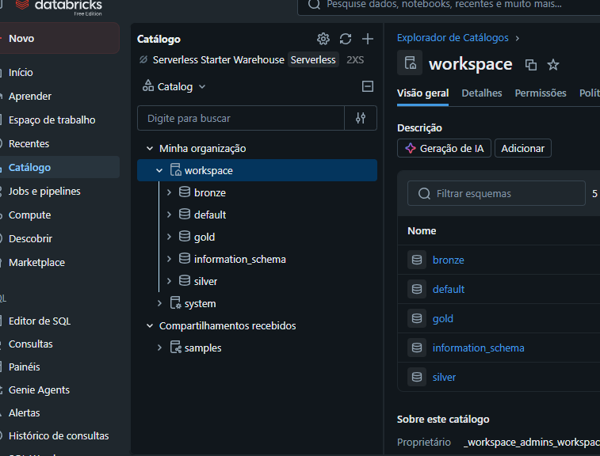

*Figura 1 – Schemas bronze, silver e gold criados para a arquitetura medalhão.*

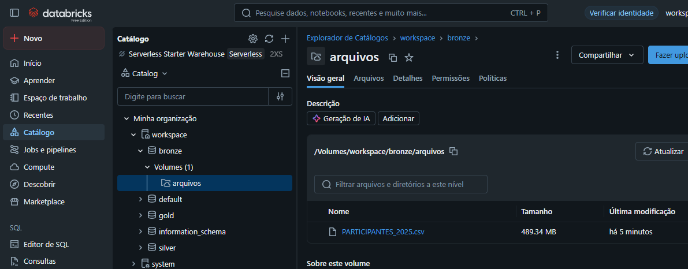

*Figura 2 – Arquivo PARTICIPANTES_2025.csv (489,34 MB) armazenado no volume bronze.arquivos.*

Em seguida, o notebook [`01_bronze`](notebooks/01_bronze.ipynb) gravou a tabela `bronze.participantes` com o conteúdo do CSV sem alterações, acrescentando apenas dois metadados de controle (data da ingestão e arquivo de origem):

```sql
CREATE OR REPLACE TABLE workspace.bronze.participantes AS
SELECT *,
       current_timestamp()      AS data_ingestao,
       'PARTICIPANTES_2025.csv' AS arquivo_origem
FROM read_files(
  '/Volumes/workspace/bronze/arquivos/PARTICIPANTES_2025.csv',
  format => 'csv', header => true, sep => ';', encoding => 'ISO-8859-1'
);
```

**Resultado:** 4.810.772 linhas e 41 colunas (as 39 originais mais os 2 metadados), com os acentos dos nomes de municípios lidos corretamente, o que confirma o encoding ISO-8859-1.

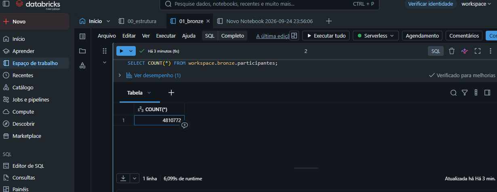

*Figura 3 – Contagem de linhas da tabela bronze.participantes: 4.810.772 registros.*

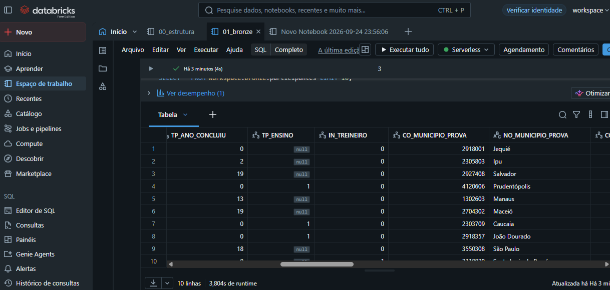

*Figura 4 – Amostra da tabela bronze, com nomes de municípios acentuados lidos corretamente.*

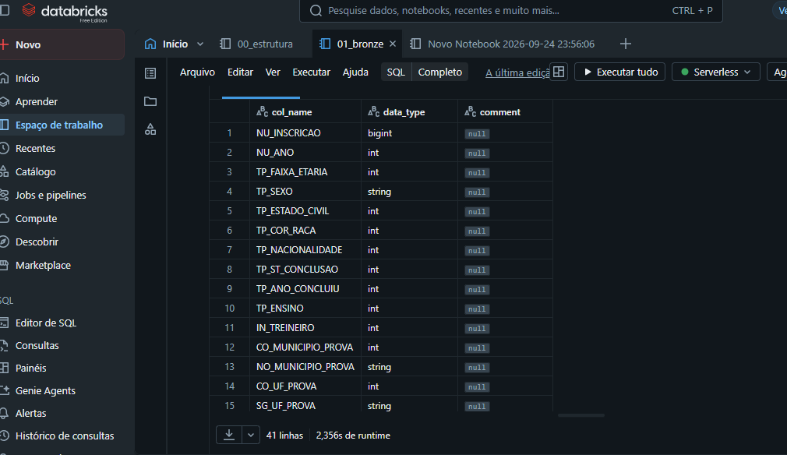

*Figura 5 – Estrutura da tabela bronze (DESCRIBE): 41 colunas.*

---

## 3. Modelagem e Catálogo de Dados (Etapa 4.3)

### 3.1 Arquitetura medalhão

| Camada | Tabela(s) | Conteúdo |
|---|---|---|
| **Bronze** | `bronze.participantes` | Cópia fiel do CSV do Inep (39 colunas) + metadados de ingestão |
| **Silver** | `silver.participantes` | 6 colunas selecionadas, renomeadas, padronizadas e com vazios tratados |
| **Gold** | `gold.fato_inscricao` + 4 dimensões | Modelo estrela pronto para responder às perguntas de negócio |

*Tabela 2 – Camadas da arquitetura medalhão.*

### 3.2 Modelo estrela (camada gold)

A camada gold foi modelada em **esquema estrela**, com a tabela fato `fato_inscricao` (**grão: uma linha por inscrito**) e quatro dimensões, que traduzem os códigos do Inep e acrescentam as regras de negócio da campanha.

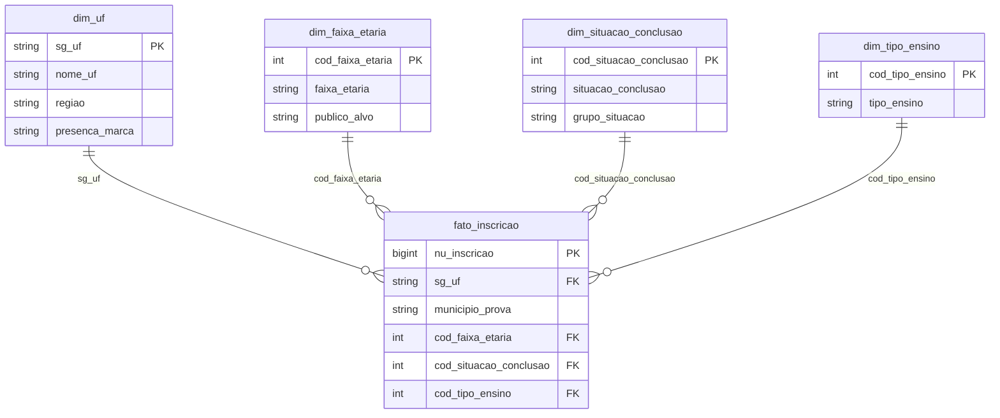
```mermaid
erDiagram
    dim_uf ||--o{ fato_inscricao : "sg_uf"
    dim_faixa_etaria ||--o{ fato_inscricao : "cod_faixa_etaria"
    dim_situacao_conclusao ||--o{ fato_inscricao : "cod_situacao_conclusao"
    dim_tipo_ensino ||--o{ fato_inscricao : "cod_tipo_ensino"

    fato_inscricao {
        bigint nu_inscricao PK
        string sg_uf FK
        string municipio_prova
        int cod_faixa_etaria FK
        int cod_situacao_conclusao FK
        int cod_tipo_ensino FK
    }
    dim_uf {
        string sg_uf PK
        string nome_uf
        string regiao
        string presenca_marca
    }
    dim_faixa_etaria {
        int cod_faixa_etaria PK
        string faixa_etaria
        string publico_alvo
    }
    dim_situacao_conclusao {
        int cod_situacao_conclusao PK
        string situacao_conclusao
        string grupo_situacao
    }
    dim_tipo_ensino {
        int cod_tipo_ensino PK
        string tipo_ensino
    }
```

*Figura 6 – Modelo estrela da camada gold.*

| Tabela | Linhas | Papel |
|---|---|---|
| `fato_inscricao` | 4.810.772 | Uma linha por inscrito, com a chave e os códigos |
| `dim_uf` | 27 | UF, nome, região e presença atual da marca |
| `dim_faixa_etaria` | 21 | Faixas etárias do dicionário do Inep + marcação do público-alvo |
| `dim_situacao_conclusao` | 5 | Situação de conclusão do ensino médio + agrupamento para análise |
| `dim_tipo_ensino` | 3 | Tipo de ensino do ensino médio |

*Tabela 3 – Tabelas da camada gold.*

**Decisões de modelagem**

- **`publico_alvo`** (em `dim_faixa_etaria`): transforma a regra de negócio "16 a 20 anos" em dado. Recebe "Sim" nos códigos 1 a 5 (de "menor de 17 anos" a "20 anos"). Como o Inep não tem um código só para 16 anos, a faixa "menor de 17 anos" foi usada como aproximação, e pode incluir eventuais inscritos com menos de 16 anos.
- **`grupo_situacao`** (em `dim_situacao_conclusao`): agrupa os códigos 2 e 3 em "Cursando o ensino médio", o que torna direta a resposta da pergunta 4.
- **`presenca_marca`** (em `dim_uf`): marca com "Sim" os estados onde o grupo já atua (BA e MG), o que permite separar praças atuais de novos mercados na pergunta 1.
- **Código 0 = "Não informado"**: os valores vazios foram convertidos para 0 na camada silver, e todas as dimensões codificadas têm essa linha. Assim, nenhum inscrito "some" das contagens nas junções.

**Integridade do modelo.** O teste de integridade referencial (códigos da fato sem correspondência nas dimensões) resultou em **0 em todas as dimensões**.

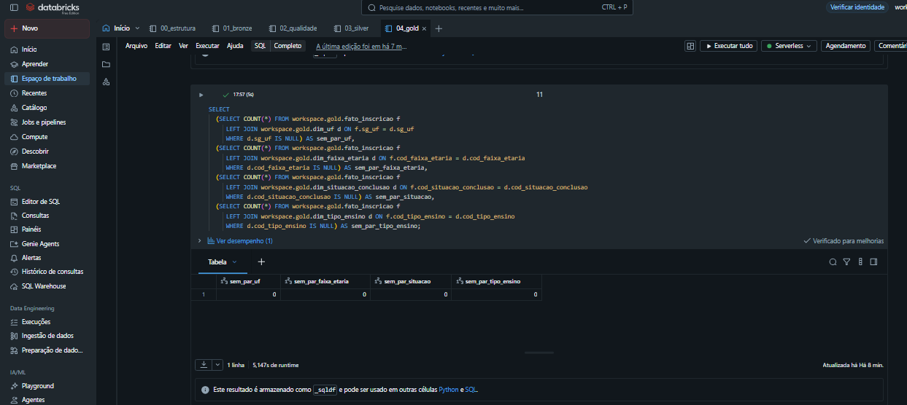

*Figura 7 – Teste de integridade: 0 registros sem correspondência em todas as dimensões.*

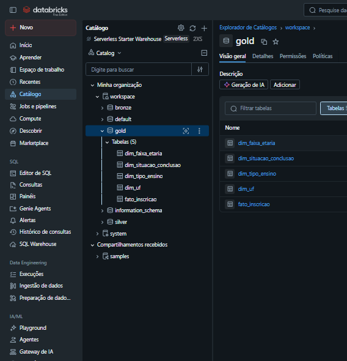

*Figura 8 – Tabelas da camada gold persistidas no Unity Catalog.*

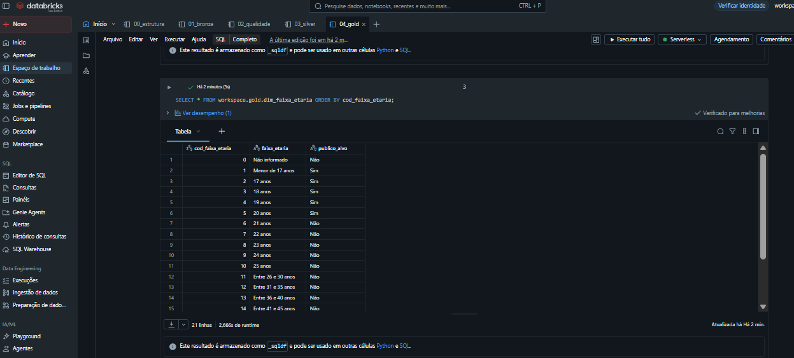

*Figura 9 – Dimensão de faixa etária, com a coluna publico_alvo.*

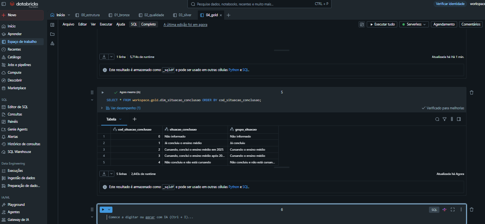

*Figura 10 – Dimensão de situação de conclusão, com a coluna grupo_situacao.*

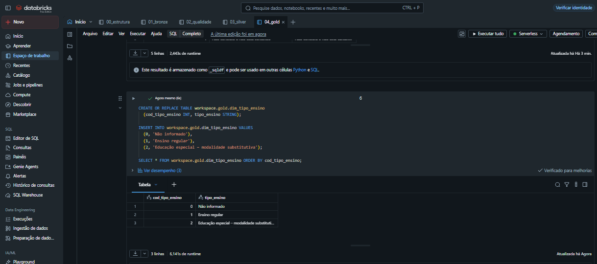

*Figura 11 – Dimensão de tipo de ensino.*

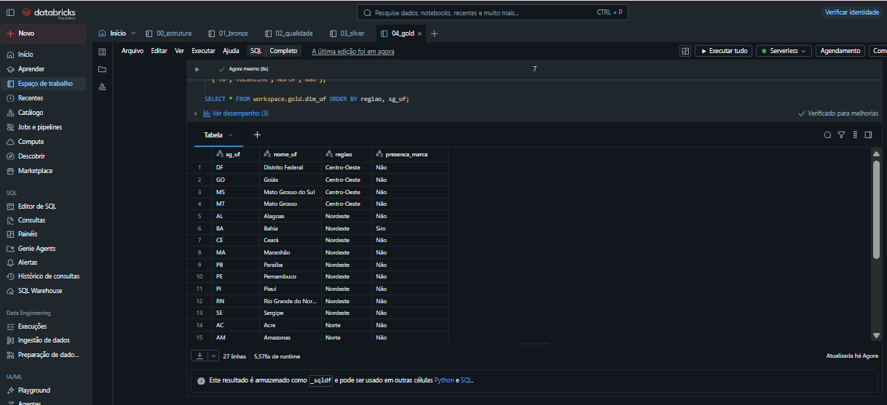

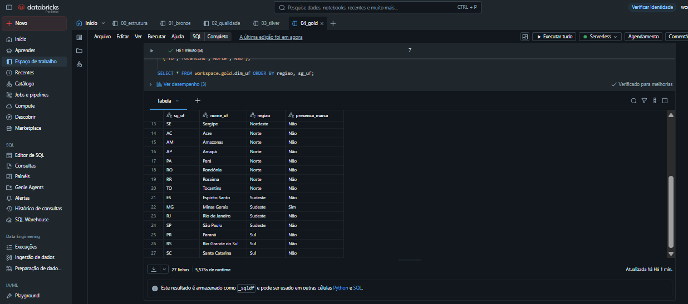

*Figura 12 – Dimensão de UF, com região e presença da marca (27 linhas, em duas partes).*

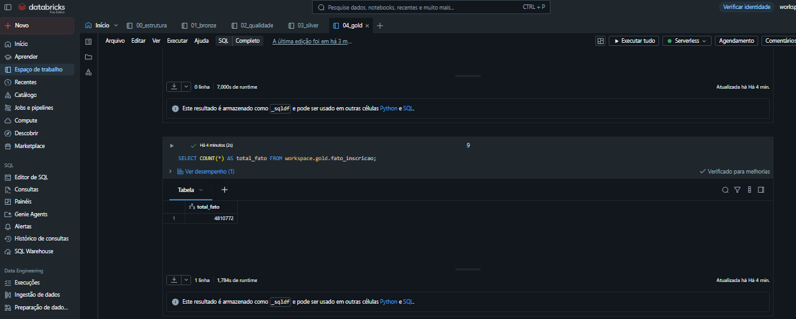

*Figura 13 – Contagem de linhas da tabela fato: 4.810.772, igual à bronze e à silver.*

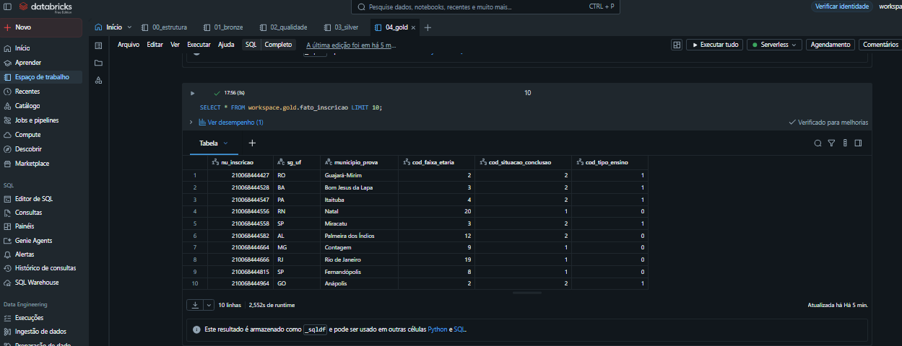

*Figura 14 – Amostra da tabela fato.*

### 3.3 Catálogo de dados

O catálogo foi registrado no **Unity Catalog**, com uma descrição para cada tabela e para cada coluna das camadas silver e gold; na bronze, foram descritos os metadados de ingestão, e as colunas originais seguem o dicionário do Inep (notebook [`05_catalogo`](notebooks/05_catalogo.ipynb), com os comandos `COMMENT ON TABLE` e `ALTER TABLE ... ALTER COLUMN ... COMMENT`). Cada descrição informa o significado, o domínio de valores e a origem (linhagem) do campo.

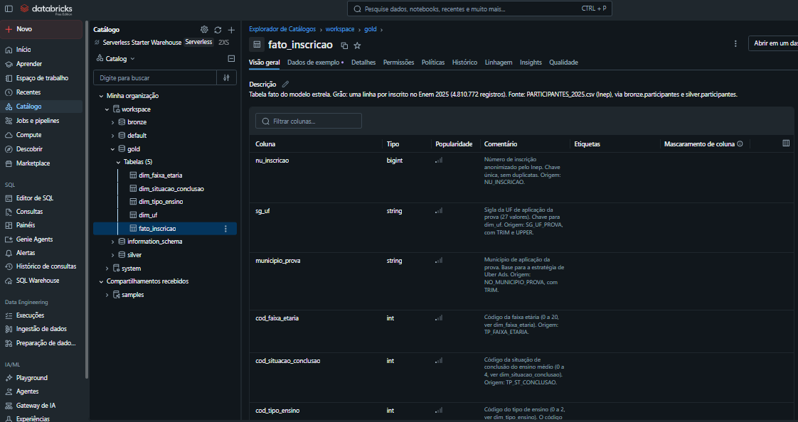

*Figura 15 – Descrição da tabela fato e de cada coluna registrada no Unity Catalog.*

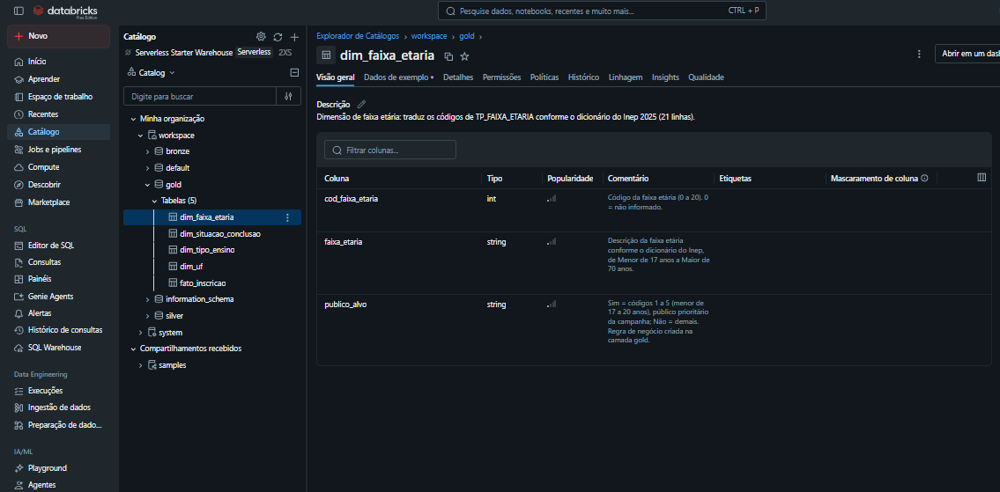

*Figura 16 – Descrição da dimensão de faixa etária e de suas colunas registrada no Unity Catalog.*

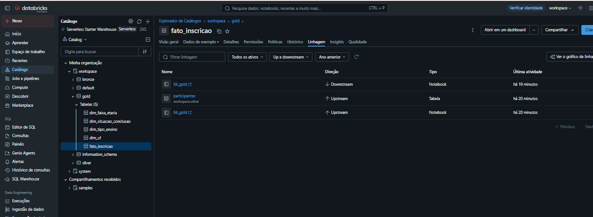

*Figura 17 – Linhagem da tabela fato: origem na silver.participantes, pelo notebook 04_gold.*

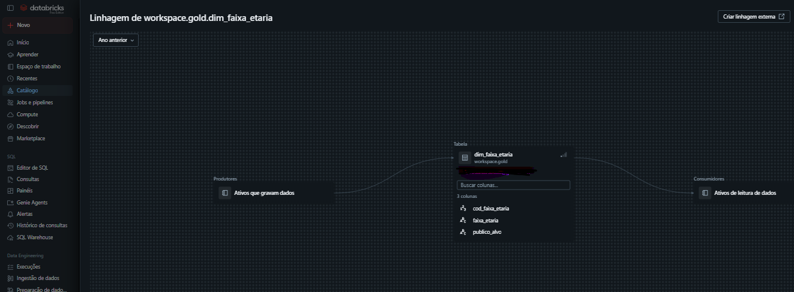

*Figura 18 – Gráfico de linhagem do pipeline.*

A seguir, o catálogo transcrito.

#### `bronze.participantes`

Cópia fiel de `PARTICIPANTES_2025.csv` (Inep), sem alterações, com as 39 colunas originais mais 2 metadados de controle. As colunas originais estão descritas no dicionário oficial do Inep; abaixo, as usadas no estudo e os metadados.

| Coluna | Tipo | Descrição | Domínio | Linhagem |
|---|---|---|---|---|
| NU_INSCRICAO | bigint | Número de inscrição anonimizado | 12 dígitos; único por inscrito | PARTICIPANTES_2025.csv |
| SG_UF_PROVA | string | UF de aplicação da prova | 27 siglas de UF | PARTICIPANTES_2025.csv |
| NO_MUNICIPIO_PROVA | string | Município de aplicação da prova | Nomes de municípios brasileiros | PARTICIPANTES_2025.csv |
| TP_FAIXA_ETARIA | int | Faixa etária | 1 a 20 | PARTICIPANTES_2025.csv |
| TP_ST_CONCLUSAO | int | Situação de conclusão do ensino médio | 1 a 4 | PARTICIPANTES_2025.csv |
| TP_ENSINO | int | Tipo de instituição do ensino médio | 1, 2 ou vazio | PARTICIPANTES_2025.csv |
| data_ingestao | timestamp | Data e hora da carga (UTC) | Data e hora | Criada na bronze |
| arquivo_origem | string | Nome do arquivo de origem | "PARTICIPANTES_2025.csv" | Criada na bronze |

*Tabela 4 – Catálogo da tabela bronze.participantes (colunas usadas no estudo e metadados).*

#### `silver.participantes`

As 6 colunas selecionadas da bronze, renomeadas, padronizadas e com os vazios de TP_ENSINO tratados. Uma linha por inscrito (4.810.772 registros).

| Coluna | Tipo | Descrição | Domínio | Linhagem |
|---|---|---|---|---|
| nu_inscricao | bigint | Número de inscrição anonimizado | Único por inscrito | NU_INSCRICAO |
| sg_uf | string | Sigla da UF de prova | 27 siglas | SG_UF_PROVA + TRIM e UPPER |
| municipio_prova | string | Município de prova | Nomes de municípios | NO_MUNICIPIO_PROVA + TRIM |
| cod_faixa_etaria | int | Código da faixa etária | 1 a 20 | TP_FAIXA_ETARIA + CAST |
| cod_situacao_conclusao | int | Código da situação de conclusão | 1 a 4 | TP_ST_CONCLUSAO + CAST |
| cod_tipo_ensino | int | Código do tipo de ensino | 0 a 2 (0 = não informado) | TP_ENSINO + CAST e COALESCE |
| data_ingestao | timestamp | Data e hora da carga na bronze (UTC) | Data e hora | bronze.participantes |

*Tabela 5 – Catálogo da tabela silver.participantes.*

#### `gold.fato_inscricao`

Tabela fato do modelo estrela. Grão: uma linha por inscrito no Enem 2025 (4.810.772 registros).

| Coluna | Tipo | Descrição | Domínio | Linhagem |
|---|---|---|---|---|
| nu_inscricao | bigint | Número de inscrição anonimizado (chave única) | Único, sem duplicatas | silver.participantes ← NU_INSCRICAO |
| sg_uf | string | UF de aplicação da prova; chave para `dim_uf` | 27 siglas | silver ← SG_UF_PROVA |
| municipio_prova | string | Município de aplicação da prova; base para o Uber Ads | Nomes de municípios | silver ← NO_MUNICIPIO_PROVA |
| cod_faixa_etaria | int | Código da faixa etária; chave para `dim_faixa_etaria` | 0 a 20 | silver ← TP_FAIXA_ETARIA |
| cod_situacao_conclusao | int | Código da situação de conclusão; chave para `dim_situacao_conclusao` | 0 a 4 | silver ← TP_ST_CONCLUSAO |
| cod_tipo_ensino | int | Código do tipo de ensino; chave para `dim_tipo_ensino` | 0 a 2 (0 atribuído a 3.080.608 vazios) | silver ← TP_ENSINO |

*Tabela 6 – Catálogo da tabela gold.fato_inscricao.*

#### `gold.dim_uf`

Dimensão de unidades da federação, criada manualmente com base na divisão regional do IBGE (27 linhas).

| Coluna | Tipo | Descrição | Domínio | Linhagem |
|---|---|---|---|---|
| sg_uf | string | Sigla da UF (chave) | 27 siglas | Divisão regional do IBGE |
| nome_uf | string | Nome da unidade da federação | 27 nomes | Divisão regional do IBGE |
| regiao | string | Região do Brasil | Norte, Nordeste, Centro-Oeste, Sudeste, Sul | Divisão regional do IBGE |
| presenca_marca | string | UF onde o grupo já atua | Sim (BA e MG) / Não | Regra de negócio criada na gold |

*Tabela 7 – Catálogo da tabela gold.dim_uf.*

#### `gold.dim_faixa_etaria`

Traduz os códigos de TP_FAIXA_ETARIA conforme o dicionário do Inep 2025 (21 linhas).

| Coluna | Tipo | Descrição | Domínio | Linhagem |
|---|---|---|---|---|
| cod_faixa_etaria | int | Código da faixa etária (chave) | 0 a 20 (0 = não informado) | Dicionário do Inep 2025 |
| faixa_etaria | string | Descrição da faixa etária | De "Menor de 17 anos" a "Maior de 70 anos" | Dicionário do Inep 2025 |
| publico_alvo | string | Faixa pertence ao público prioritário da campanha | Sim (códigos 1 a 5) / Não | Regra de negócio criada na gold |

*Tabela 8 – Catálogo da tabela gold.dim_faixa_etaria.*

#### `gold.dim_situacao_conclusao`

Traduz os códigos de TP_ST_CONCLUSAO conforme o dicionário do Inep 2025 (5 linhas).

| Coluna | Tipo | Descrição | Domínio | Linhagem |
|---|---|---|---|---|
| cod_situacao_conclusao | int | Código da situação (chave) | 0 a 4 (0 = não informado) | Dicionário do Inep 2025 |
| situacao_conclusao | string | Descrição da situação de conclusão do ensino médio | 5 descrições | Dicionário do Inep 2025 |
| grupo_situacao | string | Agrupamento para análise | Já concluiu (1); Cursando o ensino médio (2 e 3); Não concluiu e não está cursando (4); Não informado (0) | Regra criada na gold |

*Tabela 9 – Catálogo da tabela gold.dim_situacao_conclusao.*

#### `gold.dim_tipo_ensino`

Traduz os códigos de TP_ENSINO conforme o dicionário do Inep 2025 (3 linhas).

| Coluna | Tipo | Descrição | Domínio | Linhagem |
|---|---|---|---|---|
| cod_tipo_ensino | int | Código do tipo de ensino (chave) | 0 a 2 (0 = não informado) | Dicionário do Inep 2025 |
| tipo_ensino | string | Descrição do tipo de ensino | Ensino regular; Educação especial – modalidade substitutiva; Não informado | Dicionário do Inep 2025 |

*Tabela 10 – Catálogo da tabela gold.dim_tipo_ensino.*

---

## 4. Pipeline de Dados (Etapa 4.4)

O pipeline foi organizado em **7 notebooks SQL**, um por etapa, executados em ordem, com células de texto explicando o objetivo de cada uma. Os notebooks foram exportados da plataforma (.ipynb) e estão na pasta [`notebooks/`](notebooks/) deste repositório.

| Nº | Notebook | Lê de | Grava em | O que faz |
|---|---|---|---|---|
| 00 | [`00_estrutura`](notebooks/00_estrutura.ipynb) | — | schemas e volume | Cria as camadas bronze, silver e gold e o volume do arquivo bruto |
| 01 | [`01_bronze`](notebooks/01_bronze.ipynb) | CSV no volume | `bronze.participantes` | Carrega o CSV sem alterações e acrescenta metadados de ingestão |
| 02 | [`02_qualidade`](notebooks/02_qualidade.ipynb) | `bronze.participantes` | — | Diagnostica completude, unicidade, consistência e acurácia |
| 03 | [`03_silver`](notebooks/03_silver.ipynb) | `bronze.participantes` | `silver.participantes` | Seleciona, renomeia, padroniza e trata vazios |
| 04 | [`04_gold`](notebooks/04_gold.ipynb) | `silver.participantes` + dicionário do Inep | fato e 4 dimensões | Monta o modelo estrela e testa a integridade |
| 05 | [`05_catalogo`](notebooks/05_catalogo.ipynb) | tabelas das 3 camadas | Unity Catalog | Registra a descrição de tabelas e colunas |
| 06 | [`06_analise`](notebooks/06_analise.ipynb) | camada gold | — | Responde às 5 perguntas, com tabelas e gráficos |

*Tabela 11 – Notebooks do pipeline, em ordem de execução.*

O notebook de qualidade roda **antes** da silver: os problemas encontrados no diagnóstico definem os tratamentos aplicados na limpeza.

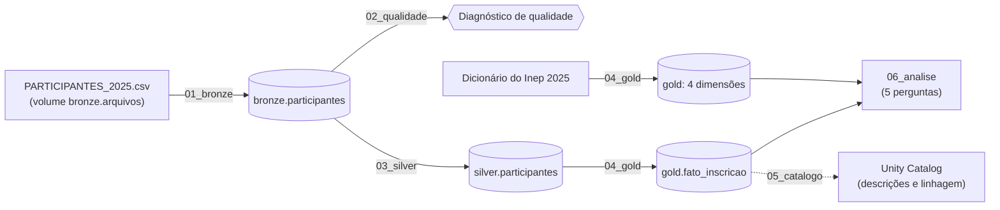
```mermaid
flowchart LR
    CSV["PARTICIPANTES_2025.csv<br/>(volume bronze.arquivos)"] -->|01_bronze| BR[("bronze.participantes")]
    BR -->|02_qualidade| QA{{"Diagnóstico de qualidade"}}
    BR -->|03_silver| SV[("silver.participantes")]
    SV -->|04_gold| FT[("gold.fato_inscricao")]
    DIC["Dicionário do Inep 2025"] -->|04_gold| DM[("gold: 4 dimensões")]
    FT --> AN["06_analise<br/>(5 perguntas)"]
    DM --> AN
    FT -.->|05_catalogo| UC["Unity Catalog<br/>(descrições e linhagem)"]
```

*Figura 19 – Fluxo do pipeline, da carga do arquivo bruto à análise.*

### 4.1 Transformações da camada silver

```sql
CREATE OR REPLACE TABLE workspace.silver.participantes AS
SELECT DISTINCT
    NU_INSCRICAO                                AS nu_inscricao,
    UPPER(TRIM(SG_UF_PROVA))                    AS sg_uf,
    TRIM(NO_MUNICIPIO_PROVA)                    AS municipio_prova,
    COALESCE(CAST(TP_FAIXA_ETARIA AS INT), 0)   AS cod_faixa_etaria,
    COALESCE(CAST(TP_ST_CONCLUSAO AS INT), 0)   AS cod_situacao_conclusao,
    COALESCE(CAST(TP_ENSINO AS INT), 0)         AS cod_tipo_ensino,
    data_ingestao
FROM workspace.bronze.participantes
WHERE NU_INSCRICAO IS NOT NULL;
```

| Transformação | Motivo | Impacto |
|---|---|---|
| Seleção de 6 das 39 colunas | Manter só o necessário para as perguntas | Tabela mais leve e focada |
| Renomeação das colunas (por exemplo, `SG_UF_PROVA` → `sg_uf`) | Nomes padronizados e mais claros | Nenhuma alteração nos dados |
| `TRIM` e `UPPER` em UF e município | Remover espaços e padronizar a escrita | Evita agrupamentos errados na análise |
| `CAST(... AS INT)` nas colunas codificadas | Garantir o tipo numérico dos códigos | Junções corretas com as dimensões |
| `DISTINCT` | Garantir que não há inscrições repetidas | 0 linhas removidas (4.810.772 antes e depois) |
| `COALESCE(..., 0)` | Transformar vazios em "Não informado" | 3.080.608 registros de TP_ENSINO passaram a ter o código 0 |

*Tabela 12 – Transformações da camada silver.*

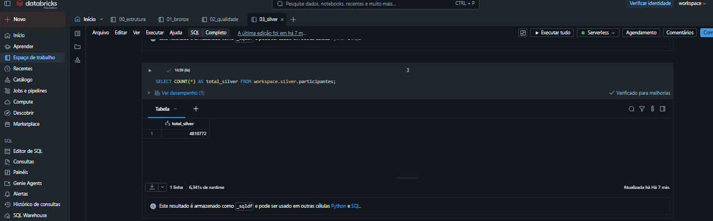

*Figura 20 – Contagem da silver: 4.810.772 linhas, igual à bronze.*

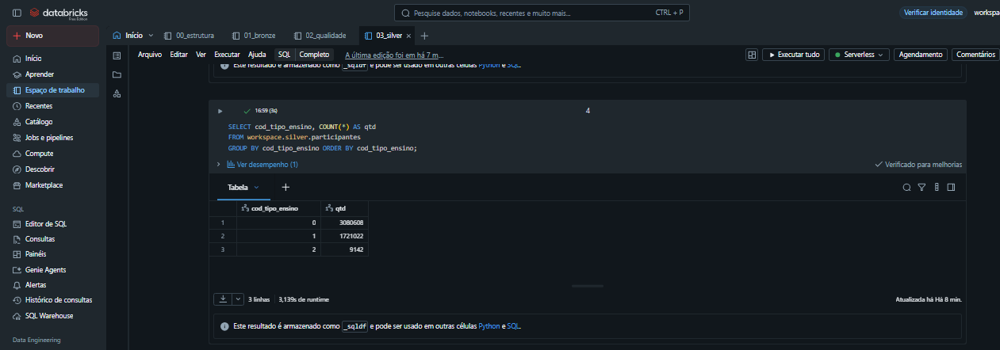

*Figura 21 – Tratamento dos vazios de TP_ENSINO: código 0 com 3.080.608 registros.*

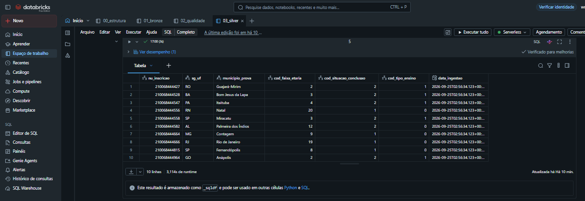

*Figura 22 – Amostra da silver com as colunas padronizadas.*

### 4.2 Transformações da camada gold

As dimensões foram criadas com `CREATE TABLE` + `INSERT`, a partir dos códigos do dicionário do Inep; a fato foi criada a partir da silver:

```sql
CREATE OR REPLACE TABLE workspace.gold.fato_inscricao AS
SELECT nu_inscricao, sg_uf, municipio_prova,
       cod_faixa_etaria, cod_situacao_conclusao, cod_tipo_ensino
FROM workspace.silver.participantes;
```

| Transformação | Motivo | Impacto |
|---|---|---|
| Criação das 4 dimensões, com os códigos do dicionário do Inep e as colunas de regra de negócio | Traduzir códigos em textos e marcar o público-alvo, a situação escolar e as praças da marca | Perguntas respondidas com consultas simples |
| Criação da fato a partir da silver, unida às dimensões por JOIN nas consultas | Separar as inscrições dos atributos descritivos | Modelo estrela com grão de uma linha por inscrito |
| Teste de integridade referencial | Garantir que todo código da fato existe na dimensão | 0 registros sem correspondência |

*Tabela 13 – Transformações da camada gold.*

As evidências de que todas as tabelas foram persistidas na plataforma estão nas figuras da seção [3. Modelagem e Catálogo de Dados](#3-modelagem-e-catálogo-de-dados-etapa-43).

---

## 5. Qualidade de Dados (Etapa 4.5)

A verificação foi feita na camada bronze, antes de qualquer tratamento (notebook [`02_qualidade`](notebooks/02_qualidade.ipynb)), para cada uma das 6 colunas do estudo.

| Dimensão | Coluna(s) | Verificação | Resultado | Tratamento |
|---|---|---|---|---|
| **Completude** | NU_INSCRICAO, SG_UF_PROVA, NO_MUNICIPIO_PROVA, TP_FAIXA_ETARIA, TP_ST_CONCLUSAO | Contagem de vazios | 0 vazios | Nenhum |
| **Completude** | TP_ENSINO | Contagem de vazios | **3.080.608 vazios (64,0%)** | Na silver, vazios viram código 0 = "Não informado" |
| **Unicidade** | NU_INSCRICAO | Linhas × inscrições distintas | 4.810.772 linhas e 4.810.772 inscrições únicas | Nenhuma duplicata; o `DISTINCT` da silver fica como garantia |
| **Consistência** | TP_FAIXA_ETARIA | Códigos × dicionário | 20 códigos (1 a 20), todos previstos | Nenhum |
| **Consistência** | TP_ST_CONCLUSAO | Códigos × dicionário | 4 códigos (1 a 4), todos previstos; a soma bate com o total | Nenhum |
| **Consistência** | TP_ENSINO | Códigos × dicionário | Só os códigos 1 e 2, além dos vazios | Vazios tratados como "Não informado" |
| **Acurácia** | SG_UF_PROVA | UFs distintas | 27 UFs (26 estados + DF), nenhuma sigla inválida | Nenhum |
| **Acurácia** | NO_MUNICIPIO_PROVA | Leitura de acentos | Nomes corretos (encoding ISO-8859-1 adequado) | Nenhum |
| **Outliers** | Todas | Códigos fora do domínio | As colunas são categóricas: nenhum código fora do dicionário | Nenhum |
| **Volume** | Tabela inteira | Comparação com o número oficial | 4.810.772 registros contra 4.811.338 oficiais (diferença de 566, cerca de 0,01%) | Nenhum; base completa para a análise |

*Tabela 14 – Resultado das verificações de qualidade e tratamentos aplicados.*

Um cuidado adicional: existem municípios com o mesmo nome em estados diferentes. Por isso, a análise sempre agrupa por **município + UF**.

**Conclusão:** a base está íntegra. O único problema relevante é a baixa completude de TP_ENSINO (64% de vazios), que limita a pergunta 5 e foi tratado para que nenhum inscrito fosse descartado das contagens.

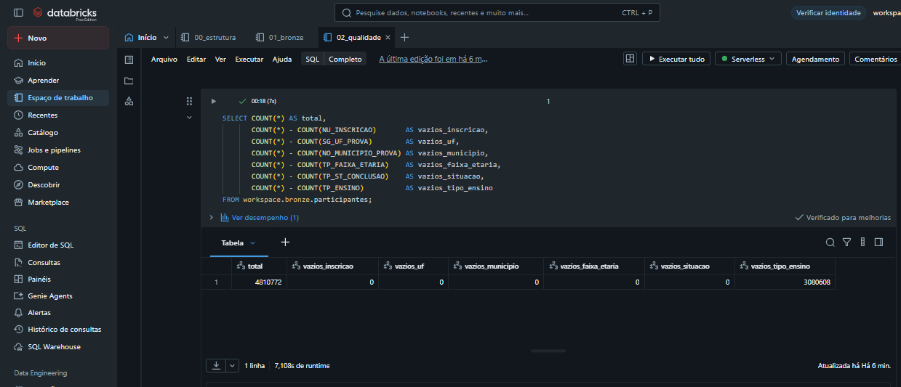

*Figura 23 – Completude: vazios por coluna.*

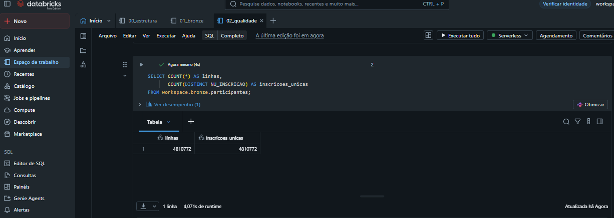

*Figura 24 – Unicidade: nenhuma inscrição duplicada.*

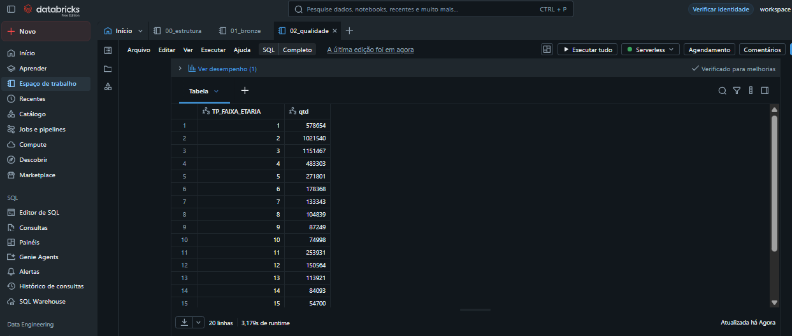

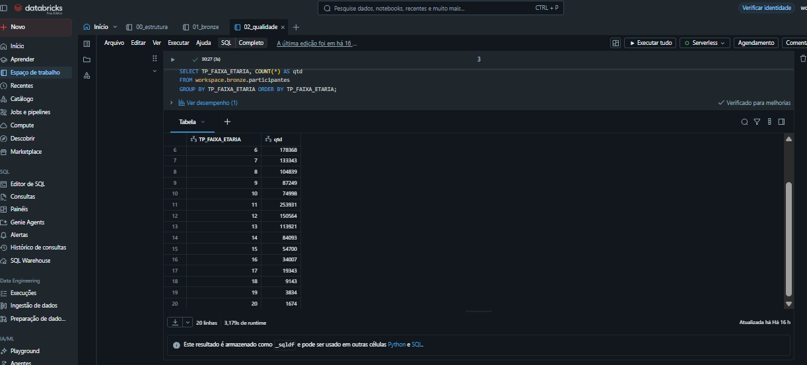

*Figura 25 – Consistência da faixa etária: 20 códigos, todos previstos no dicionário (em duas partes).*

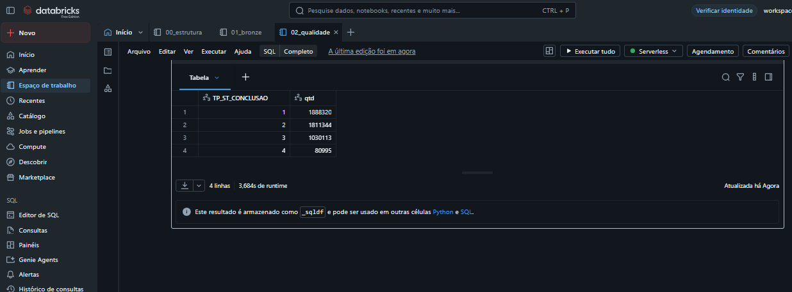

*Figura 26 – Consistência da situação de conclusão: códigos 1 a 4.*

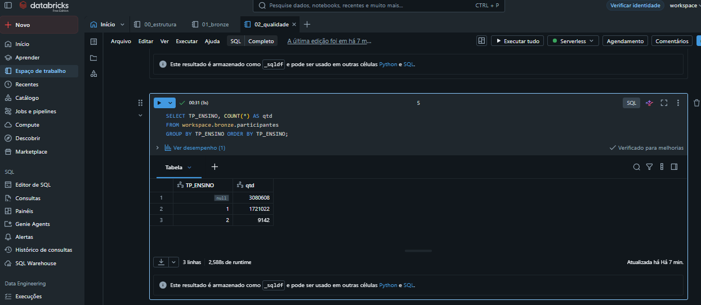

*Figura 27 – Consistência do tipo de ensino: vazios (null) antes do tratamento.*

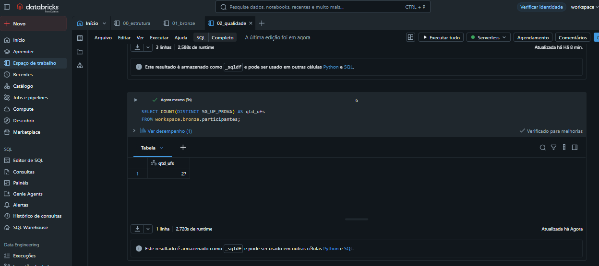

*Figura 28 – Acurácia: 27 UFs distintas.*

**Antes e depois do tratamento de TP_ENSINO:** na bronze, os vazios aparecem como `null` (Figura 27); na silver, aparecem como código 0 = "Não informado" (Figura 21, na seção [4. Pipeline de Dados](#4-pipeline-de-dados-etapa-44)).

---

## 6. Análise de Dados (Etapa 4.5)

As consultas estão no notebook [`06_analise`](notebooks/06_analise.ipynb) e usam o modelo estrela da camada gold.

### 6.1 Pergunta 1: Quais estados e municípios de prova concentram mais inscritos, além de Bahia e Minas Gerais?

Para responder, a tabela fato foi agrupada por UF, por região e por município de prova, com a `dim_uf` separando os estados onde a marca já atua dos novos mercados.

<details>
<summary><b>Consultas SQL</b></summary>

```sql
-- Inscritos por UF
SELECT d.sg_uf, d.nome_uf, d.regiao, d.presenca_marca,
       COUNT(*) AS inscritos,
       ROUND(100.0 * COUNT(*) / SUM(COUNT(*)) OVER (), 1) AS percentual
FROM workspace.gold.fato_inscricao f
JOIN workspace.gold.dim_uf d ON f.sg_uf = d.sg_uf
GROUP BY d.sg_uf, d.nome_uf, d.regiao, d.presenca_marca
ORDER BY inscritos DESC;

-- Inscritos por região
SELECT d.regiao, COUNT(*) AS inscritos,
       ROUND(100.0 * COUNT(*) / SUM(COUNT(*)) OVER (), 1) AS percentual
FROM workspace.gold.fato_inscricao f
JOIN workspace.gold.dim_uf d ON f.sg_uf = d.sg_uf
GROUP BY d.regiao
ORDER BY inscritos DESC;

-- Os 20 municípios de prova com mais inscritos fora de BA e MG
SELECT f.municipio_prova, f.sg_uf, COUNT(*) AS inscritos
FROM workspace.gold.fato_inscricao f
JOIN workspace.gold.dim_uf d ON f.sg_uf = d.sg_uf
WHERE d.presenca_marca = 'Não'
GROUP BY f.municipio_prova, f.sg_uf
ORDER BY inscritos DESC
LIMIT 20;
```

</details>

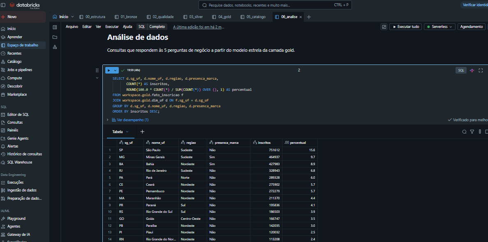

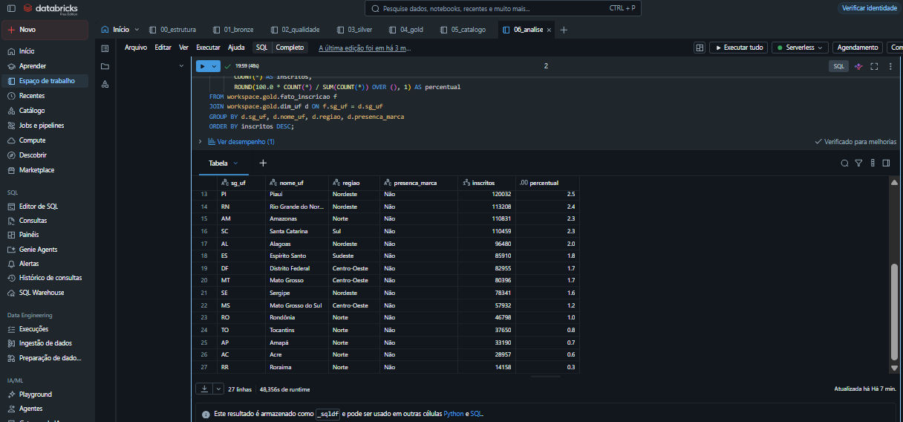

*Figura 29 – Resultado da consulta de inscritos por UF (27 linhas, em duas partes).*

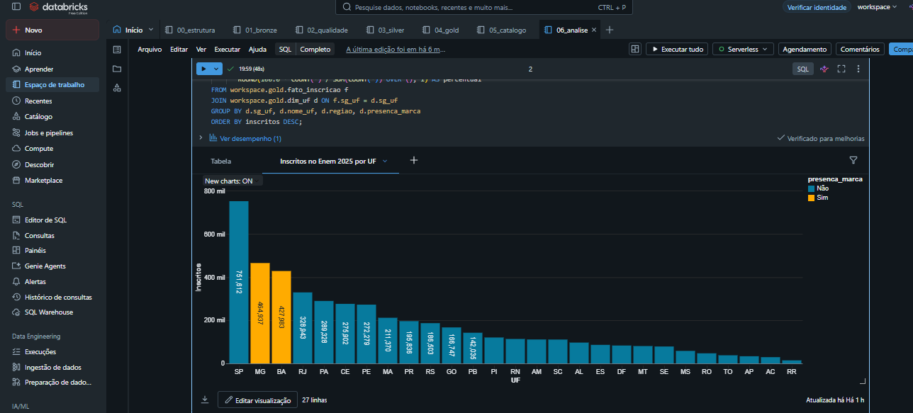

*Figura 30 – Inscritos no Enem 2025 por UF, com BA e MG em destaque.*

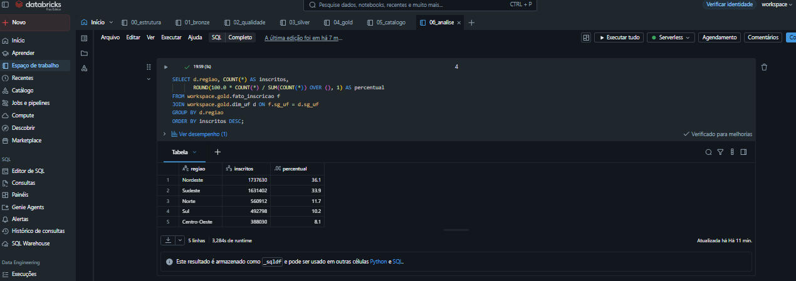

*Figura 31 – Resultado da consulta de inscritos por região.*

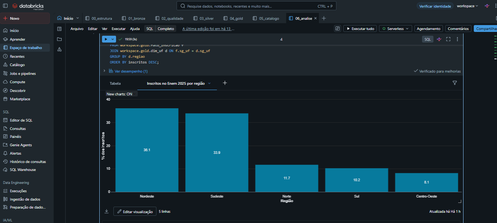

*Figura 32 – Inscritos no Enem 2025 por região (%).*

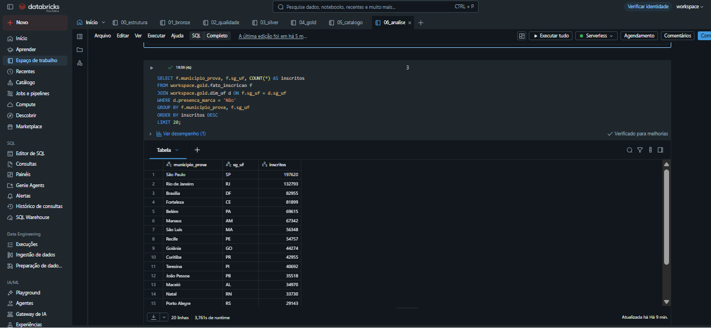

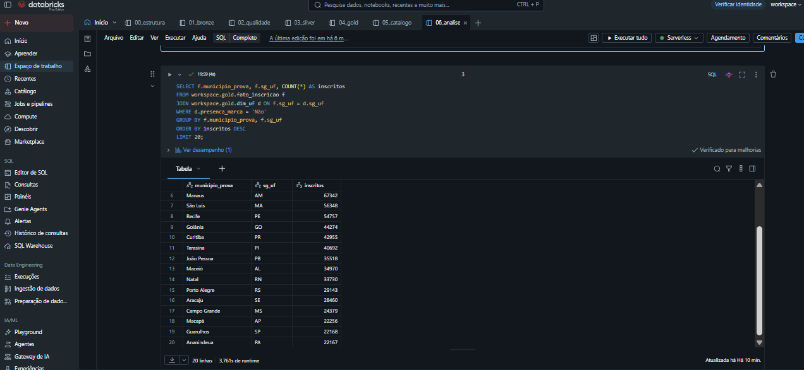

*Figura 33 – Resultado da consulta dos 20 municípios de prova com mais inscritos fora de BA e MG (em duas partes).*

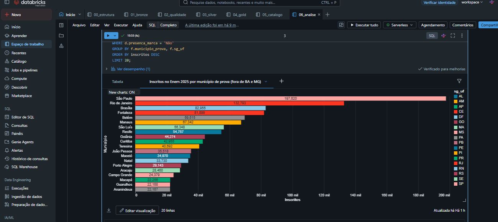

*Figura 34 – Inscritos por município de prova, fora de BA e MG.*

**Leitura dos resultados**

Os percentuais por UF e por região vêm da coluna `percentual` das consultas (Figuras 29 e 31). Os demais são somas desses percentuais ou foram calculados a partir das contagens das Figuras 29 e 33.

- **81,4% dos inscritos estão fora de BA e MG**, as praças atuais do grupo, que somam 18,6%.
- **São Paulo lidera, com 15,6%.** Junto com **RJ, PA, CE e PE**, forma o primeiro grupo de prioridade, com **39,9%** dos inscritos. **MA, PR, RS, GO e PB** somam mais 18,8%.
- **Nordeste (36,1%) e Sudeste (33,9%)** concentram 70% dos inscritos. Sem a Bahia, o Nordeste ainda tem 27,2% do total.
- **Os 20 municípios da lista somam 23,4% dos inscritos**, e 18 deles são capitais. O peso da capital no estado varia muito: Macapá reúne 67,1% dos inscritos do Amapá e Manaus, 60,8% dos do Amazonas; já Porto Alegre tem apenas 15,6% dos inscritos do Rio Grande do Sul.

**Implicação para a campanha:** priorizar **SP, RJ, CE, PE e PA** na mídia nacional. No **Uber Ads**, ativar as capitais da lista no trajeto casa → local de prova, com mais eficiência onde a capital concentra o público do estado; onde o público é mais espalhado, como no RS, canais digitais de alcance estadual tendem a render mais.

### 6.2 Pergunta 2: O público de 16 a 20 anos representa de fato mais da metade dos inscritos?

Para responder, a tabela fato foi unida à `dim_faixa_etaria` e agrupada pela coluna `publico_alvo`, criada na camada gold para marcar a faixa de 16 a 20 anos.

<details>
<summary><b>Consultas SQL</b></summary>

```sql
-- Público-alvo (16 a 20 anos) x outras idades
SELECT CASE WHEN d.publico_alvo = 'Sim' THEN '16 a 20 anos' ELSE 'Outras idades' END AS `Faixa`,
       COUNT(*) AS inscritos,
       ROUND(100.0 * COUNT(*) / SUM(COUNT(*)) OVER (), 1) AS percentual
FROM workspace.gold.fato_inscricao f
JOIN workspace.gold.dim_faixa_etaria d ON f.cod_faixa_etaria = d.cod_faixa_etaria
GROUP BY 1
ORDER BY inscritos DESC;

-- Distribuição por faixa etária
SELECT d.cod_faixa_etaria, d.faixa_etaria, COUNT(*) AS inscritos,
       ROUND(100.0 * COUNT(*) / SUM(COUNT(*)) OVER (), 1) AS percentual
FROM workspace.gold.fato_inscricao f
JOIN workspace.gold.dim_faixa_etaria d ON f.cod_faixa_etaria = d.cod_faixa_etaria
GROUP BY d.cod_faixa_etaria, d.faixa_etaria
ORDER BY d.cod_faixa_etaria;
```

</details>

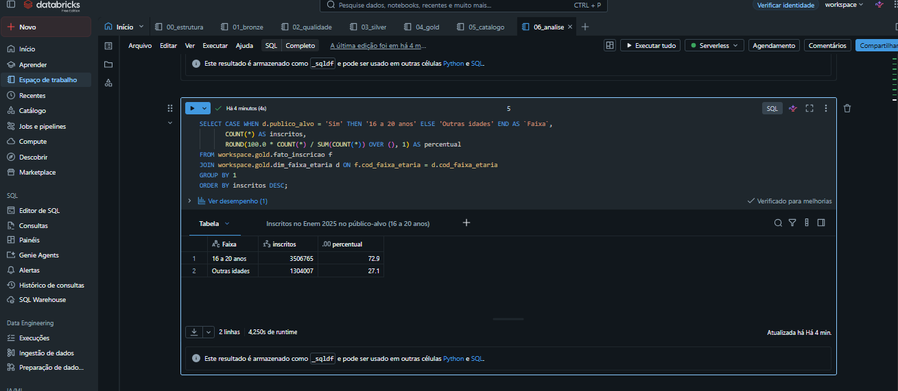

*Figura 35 – Resultado da consulta: inscritos no público-alvo (16 a 20 anos) e em outras idades.*

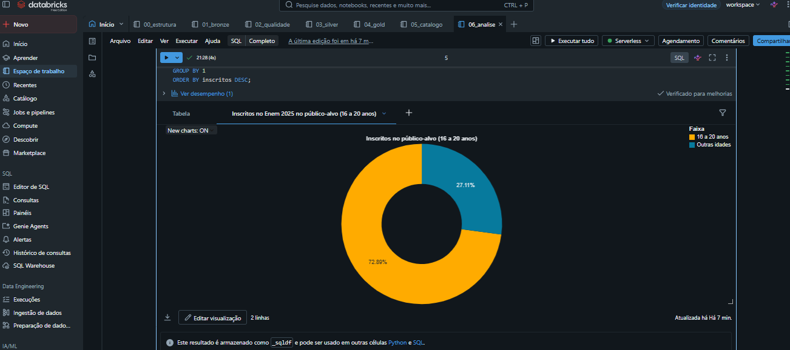

*Figura 36 – Inscritos no público-alvo (16 a 20 anos).*

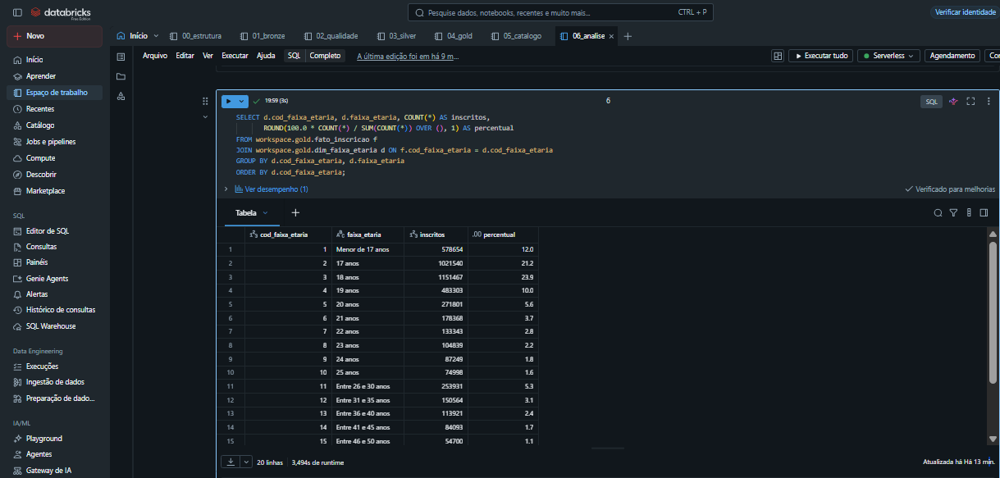

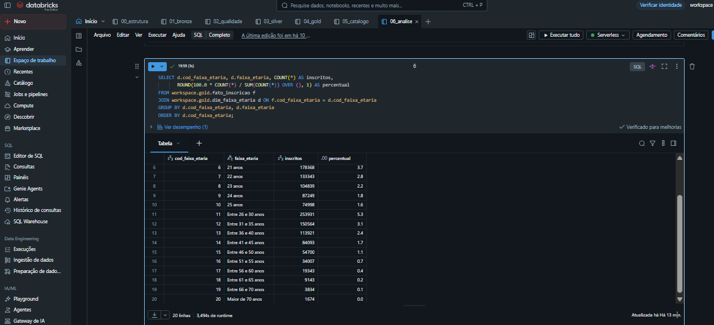

*Figura 37 – Resultado da consulta de inscritos por faixa etária (em duas partes).*

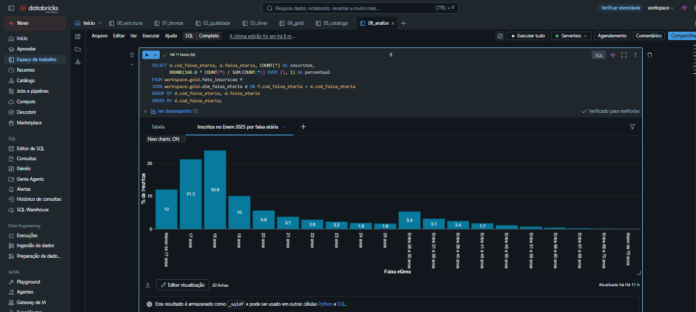

*Figura 38 – Inscritos no Enem 2025 por faixa etária (%).*

| Faixa etária | Inscritos | % do total |
|---|---|---|
| Menor de 17 anos | 578.654 | 12,0% |
| 17 anos | 1.021.540 | 21,2% |
| 18 anos | 1.151.467 | 23,9% |
| 19 anos | 483.303 | 10,0% |
| 20 anos | 271.801 | 5,6% |
| **16 a 20 anos (público-alvo)** | **3.506.765** | **72,9%** |
| 21 a 25 anos | 578.797 | 12,0% |
| 26 a 30 anos | 253.931 | 5,3% |
| 31 anos ou mais | 471.279 | 9,8% |
| **Total** | **4.810.772** | **100%** |

*Tabela 15 – Inscritos por faixa etária, com o público-alvo em destaque (faixas acima de 20 anos agrupadas a partir da Figura 37).*

**Leitura dos resultados**

- **72,9% dos inscritos (3.506.765) têm de 16 a 20 anos**, bem acima da metade, com pico nos **18 anos (23,9%)** e nos **17 anos (21,2%)**.
- Depois dos 20 anos a participação cai, mas a faixa de **21 a 25 anos ainda soma 12,0%** dos inscritos.

**Hipótese: confirmada.** O público prioritário do grupo é a grande maioria dos inscritos.

**Implicação para a campanha:** os canais voltados ao público jovem (TikTok, lives de games, YouTube e influenciadores) estão alinhados ao perfil real dos inscritos. Incluir a faixa de 21 a 25 anos, provavelmente formada por quem refaz a prova, amplia a cobertura para **84,9%** dos inscritos.

### 6.3 Pergunta 3: Os estados com mais inscritos são também os que têm a maior proporção de jovens de 16 a 20 anos?

Para responder, a tabela fato foi unida à `dim_faixa_etaria` e à `dim_uf`, e para cada estado foram calculados o total de inscritos, o número de jovens de 16 a 20 anos e o percentual que eles representam.

<details>
<summary><b>Consulta SQL</b></summary>

```sql
SELECT u.sg_uf, u.presenca_marca,
       COUNT(*) AS inscritos,
       SUM(CASE WHEN d.publico_alvo = 'Sim' THEN 1 ELSE 0 END) AS inscritos_16_20,
       ROUND(100.0 * SUM(CASE WHEN d.publico_alvo = 'Sim' THEN 1 ELSE 0 END) / COUNT(*), 1) AS pct_16_20
FROM workspace.gold.fato_inscricao f
JOIN workspace.gold.dim_faixa_etaria d ON f.cod_faixa_etaria = d.cod_faixa_etaria
JOIN workspace.gold.dim_uf u ON f.sg_uf = u.sg_uf
GROUP BY u.sg_uf, u.presenca_marca
ORDER BY pct_16_20 DESC;
```

</details>

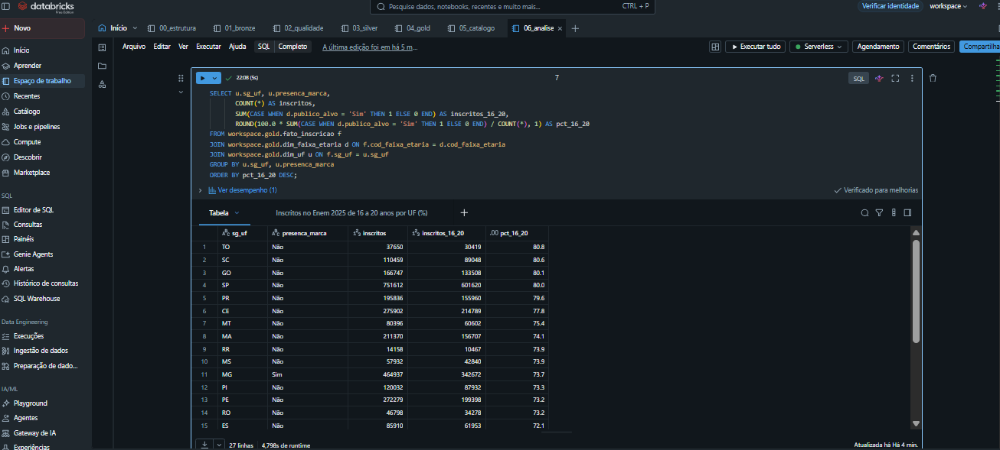

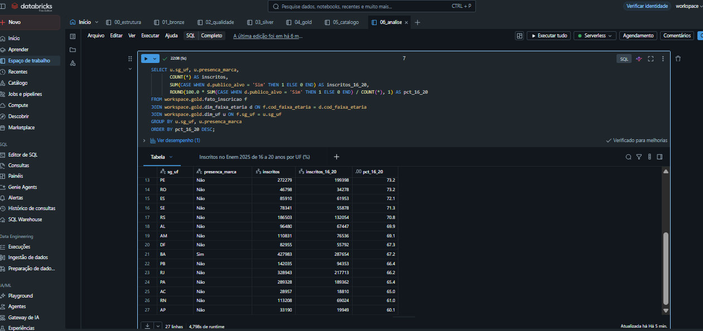

*Figura 39 – Resultado da consulta do percentual de inscritos de 16 a 20 anos por UF (27 linhas, em duas partes).*

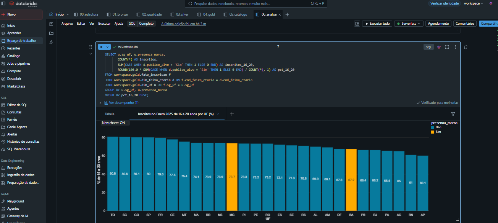

*Figura 40 – Inscritos no Enem 2025 de 16 a 20 anos por UF (%), em ordem decrescente, com BA e MG em destaque.*

| UF | Posição em volume | Inscritos | Jovens de 16 a 20 anos | % de 16 a 20 anos | Posição no % (de 27) |
|---|---|---|---|---|---|
| SP | 1º | 751.612 | 601.620 | 80,0% | 4º |
| MG | 2º | 464.937 | 342.672 | 73,7% | 11º |
| BA | 3º | 427.983 | 287.654 | 67,2% | 21º |
| RJ | 4º | 328.943 | 217.713 | 66,2% | 23º |
| PA | 5º | 289.328 | 189.362 | 65,4% | 24º |
| CE | 6º | 275.902 | 214.789 | 77,8% | 6º |
| PE | 7º | 272.279 | 199.398 | 73,2% | 13º |
| MA | 8º | 211.370 | 156.707 | 74,1% | 8º |
| PR | 9º | 195.836 | 155.960 | 79,6% | 5º |
| RS | 10º | 186.503 | 132.054 | 70,8% | 17º |

*Tabela 16 – Os 10 estados com mais inscritos: volume × proporção de jovens de 16 a 20 anos.*

**Leitura dos resultados**

- Os maiores percentuais de jovens estão em **TO (80,8%), SC (80,6%) e GO (80,1%)**; os menores, em **AP (60,1%), RN (61,0%) e AC (65,0%)**.
- **São Paulo é o único estado que combina o maior volume com uma das maiores proporções** (80,0%, 4º lugar): são **601.620 jovens**, quase o mesmo número de MG e BA juntos.
- **BA, RJ e PA**, entre os cinco estados com mais inscritos, estão entre os sete menores percentuais: uma parte maior do seu público tem 21 anos ou mais.

**Hipótese: não confirmada.** Com exceção de São Paulo, os estados com mais inscritos não são os que têm a maior proporção de jovens.

**Implicação para a campanha:** o **volume** continua definindo **onde** investir, e o **percentual de jovens** ajuda a definir **como** falar. Em SP, CE, PR e GO, os canais jovens tendem a render mais; em RJ e PA, vale reforçar portais e branded content, com mensagens também para quem refaz a prova.

### 6.4 Pergunta 4: A maior parte dos inscritos ainda está cursando o ensino médio?

Para responder, a tabela fato foi unida à `dim_situacao_conclusao` e agrupada pela coluna `grupo_situacao`, que junta os códigos de quem ainda está cursando o ensino médio.

<details>
<summary><b>Consulta SQL</b></summary>

```sql
SELECT d.grupo_situacao, COUNT(*) AS inscritos,
       ROUND(100.0 * COUNT(*) / SUM(COUNT(*)) OVER (), 1) AS percentual
FROM workspace.gold.fato_inscricao f
JOIN workspace.gold.dim_situacao_conclusao d ON f.cod_situacao_conclusao = d.cod_situacao_conclusao
GROUP BY d.grupo_situacao
ORDER BY inscritos DESC;
```

</details>

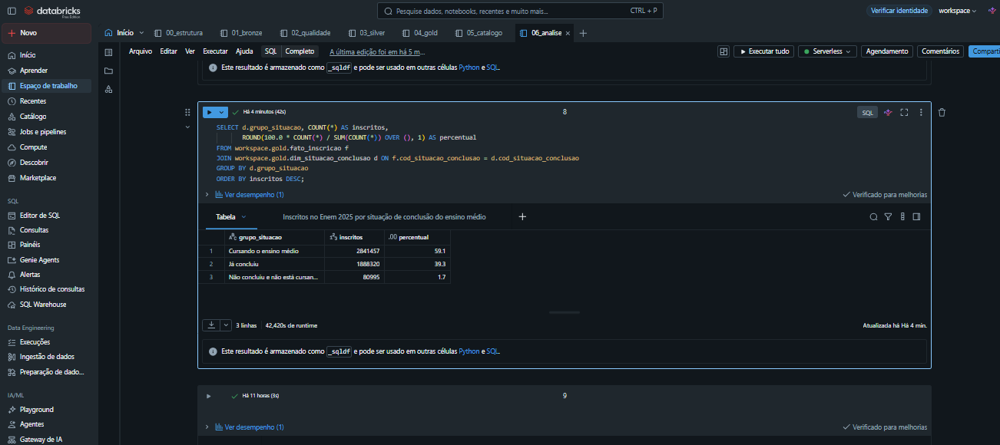

*Figura 41 – Resultado da consulta de inscritos por situação de conclusão do ensino médio.*

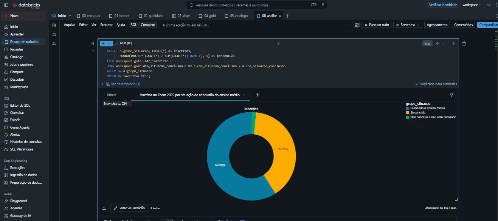

*Figura 42 – Inscritos no Enem 2025 por situação de conclusão do ensino médio.*

| Situação | Código | Inscritos | % do total |
|---|---|---|---|
| Cursando, conclui o ensino médio em 2025 | 2 | 1.811.344 | 37,7% |
| Cursando, conclui o ensino médio após 2025 | 3 | 1.030.113 | 21,4% |
| **Cursando o ensino médio (total)** | 2 + 3 | **2.841.457** | **59,1%** |
| Já concluiu o ensino médio | 1 | 1.888.320 | 39,3% |
| Não concluiu e não está cursando | 4 | 80.995 | 1,7% |

*Tabela 17 – Inscritos por situação de conclusão do ensino médio (códigos 2 e 3 detalhados a partir da Figura 26).*

**Leitura dos resultados**

- **59,1% dos inscritos ainda cursam o ensino médio**: 37,7% concluem no próprio ano da prova e 21,4% concluem depois, ou seja, fazem o Enem antes do último ano.
- Ao mesmo tempo, **39,3% (1.888.320) já concluíram o ensino médio**. Como os inscritos com 21 anos ou mais somam 1.304.007, pelo menos **584 mil jovens de até 20 anos já concluíram o ensino médio** e seguem tentando o Enem, um público típico de cursinho pré-vestibular.

**Hipótese: confirmada, com uma nuance importante.** A maioria ainda está no ensino médio, mas a parcela que já concluiu é grande o bastante para ser tratada como um público próprio.

**Implicação para a campanha:** a mensagem principal pode falar com o estudante do ensino médio, o que também conversa com as escolas próprias e parceiras do grupo. Já os quase **1,9 milhão que concluíram o ensino médio** justificam uma linha de comunicação própria, ligada aos cursos pré-vestibular.

### 6.5 Pergunta 5: A maioria dos inscritos vem de escola pública?

<details>
<summary><b>Consulta SQL</b></summary>

```sql
SELECT d.tipo_ensino, COUNT(*) AS inscritos,
       ROUND(100.0 * COUNT(*) / SUM(COUNT(*)) OVER (), 1) AS percentual
FROM workspace.gold.fato_inscricao f
JOIN workspace.gold.dim_tipo_ensino d ON f.cod_tipo_ensino = d.cod_tipo_ensino
GROUP BY d.tipo_ensino
ORDER BY inscritos DESC;
```

</details>

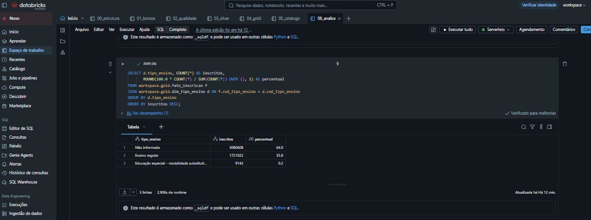

*Figura 43 – Resultado da consulta de inscritos por tipo de ensino.*

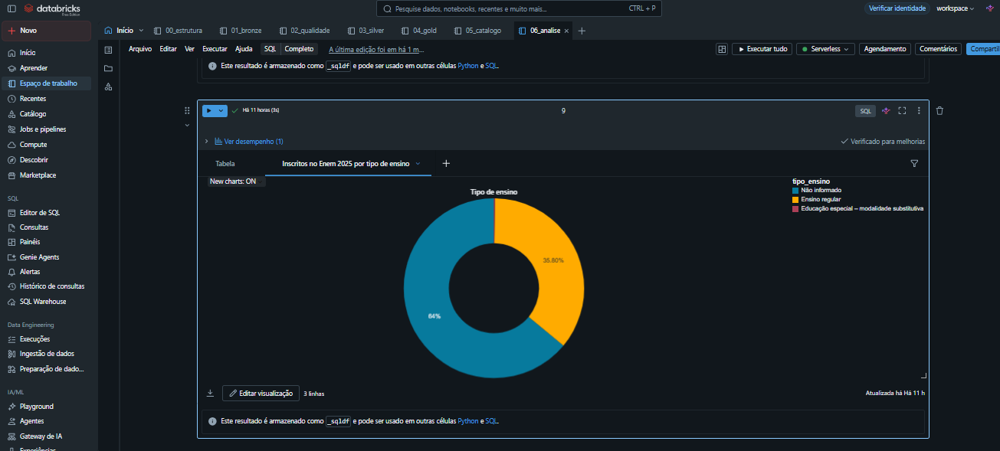

*Figura 44 – Inscritos no Enem 2025 por tipo de ensino.*

**Pergunta 5: não respondida diretamente.** O arquivo de participantes do Enem 2025 não traz a variável de tipo de escola (pública ou privada). Essa informação existe apenas no arquivo de resultados, que não pode ser ligado ao de participantes por causa da anonimização exigida pela LGPD. Como aproximação, foi analisada a variável TP_ENSINO, que indica o tipo de instituição em que o inscrito concluiu ou concluirá o ensino médio.

| Tipo de ensino | Inscritos | % do total | % dos que informaram |
|---|---|---|---|
| Não informado | 3.080.608 | 64,0% | — |
| Ensino regular | 1.721.022 | 35,8% | 99,5% |
| Educação especial – modalidade substitutiva | 9.142 | 0,2% | 0,5% |

*Tabela 18 – Inscritos por tipo de ensino.*

**Leitura dos resultados:** 64% dos inscritos não informaram o tipo de ensino. Entre os que informaram, praticamente todos (99,5%) vêm do ensino regular. O dicionário de 2025 também não tem a categoria de Educação de Jovens e Adultos (EJA), o que impede separar esse público.

**Hipótese: não verificável com os dados disponíveis.**

**Implicação para a campanha:** sem a divisão entre rede pública e privada, os dados não sustentam uma segmentação de tom por tipo de escola. A recomendação é adotar uma linguagem acessível e inclusiva, adequada a todos os perfis, e buscar essa informação em fontes complementares (ver o item [Trabalhos futuros](#trabalhos-futuros), na seção 7.2 deste documento).

### 6.6 Discussão geral

Vistas em conjunto, as respostas mostram que a estratégia do grupo acerta no público, mas precisa ampliar o mapa. O perfil jovem, que orienta a escolha dos canais, foi confirmado. Já a presença atual da marca, concentrada em BA e MG, cobre menos de um quinto dos inscritos: o alcance nacional da campanha depende de mercados onde o grupo ainda não atua. São Paulo é a principal oportunidade, por reunir o maior volume e uma das maiores proporções de jovens, e o restante do Nordeste é uma expansão natural a partir de Salvador. No Uber Ads, a concentração dos inscritos nas capitais permite começar por poucas cidades com alto alcance.

As perguntas 3 e 4 mostram, ainda, que o público não é homogêneo. Há mercados mais jovens, onde os canais voltados a esse público devem ter mais peso, e há uma parcela grande de inscritos que já concluiu o ensino médio e tende a buscar cursinho. Por isso, além de definir onde investir, os dados indicam que a campanha precisa de duas linhas de mensagem: uma para o estudante do ensino médio e outra para quem vai refazer a prova.

**Limitações:** os dados descrevem **inscritos**, e não presentes na prova; o **local de prova** não é necessariamente o local de residência; os dados de **2025** foram usados como referência para 2026, edição que teve 5,08% mais inscritos; e a pergunta 5 não pôde ser respondida por falta da variável.

---

## 7. Considerações finais e Autoavaliação

### 7.1 Pontos de melhoria

O pipeline cumpre o seu papel como MVP, mas pode evoluir com recursos que o próprio Databricks oferece e que não foram usados nesta primeira versão. Essas melhorias o tornariam mais automático, mais fácil de manter e mais útil para a equipe de marketing:

- **Automatizar a coleta e a execução:** baixar o pacote direto do site do Inep, com o acesso de saída à internet (liberado na Free Edition após a verificação da conta), e encadear os notebooks em um **Job** do Databricks, usando o ano da edição como parâmetro.
- **Automatizar a qualidade:** transformar as verificações do notebook 02 em regras (*expectations*) de um pipeline declarativo do Databricks, que interrompem a execução quando falham.
- **Integrar com o GitHub** pelos Git folders do Databricks, sem exportação manual dos notebooks.
- **Entregar um dashboard no Databricks**, para que a equipe de marketing consulte os resultados sem precisar de SQL, com filtros por região e UF e com os gráficos padronizados em percentual, como na leitura dos resultados.
- **Criar um espaço do Genie** para a equipe de marketing consultar os dados em linguagem natural (por exemplo, "quantos inscritos de 17 anos fizeram a prova em Recife?").

### 7.2 Autoavaliação

#### Minha trajetória e o desafio deste trabalho

Venho da área de Humanas, da comunicação, e atuo com mídia, em um caminho de evolução para a área de dados. Por isso, este MVP foi um grande desafio: foi a primeira vez que construí um pipeline de dados de ponta a ponta, em uma plataforma de nuvem, escrevendo consultas em SQL e organizando os dados em camadas e em um modelo estrela.

Não imaginei que o trabalho seria tão extenso. Parte disso veio da escolha dos microdados do Enem: uma base grande (quase 5 milhões de linhas), com regras próprias de anonimização e um dicionário de variáveis que precisa ser consultado a cada etapa. Escolhi esse tema por interesse profissional, porque ele se conecta diretamente com o planejamento de mídia que faço no dia a dia para clientes do segmento de educação, e isso me manteve motivada ao longo de todas as etapas.

#### Atingimento dos objetivos

| Pergunta | Resultado | Hipótese |
|---|---|---|
| 1. Estados e municípios prioritários | Respondida | Mercados relevantes fora de BA e MG identificados |
| 2. Público de 16 a 20 anos | Respondida | Confirmada (72,9%) |
| 3. Volume × proporção de jovens | Respondida | Não confirmada |
| 4. Situação de conclusão | Respondida | Confirmada, com nuance |
| 5. Escola pública | Não respondida diretamente | Não verificável: variável indisponível; resposta aproximada com TP_ENSINO |

*Tabela 19 – Atingimento dos objetivos por pergunta.*

O objetivo principal, entender o perfil e a distribuição geográfica dos inscritos para orientar a campanha, foi atingido. Quatro das cinco perguntas foram respondidas com os dados, e a quinta foi mantida no objetivo, como pede o enunciado, com a explicação de por que não pôde ser respondida.

#### Dificuldades encontradas

Como iniciei este trabalho sem experiência em engenharia de dados, precisei aprender ao mesmo tempo os conceitos (pipeline, arquitetura medalhão, esquema estrela, catálogo de dados) e a ferramenta. As principais dificuldades foram:

- entender conceitos técnicos novos para quem vem da comunicação (tipos de dados, junções entre tabelas, camadas) e a interface do Databricks;
- lidar com um arquivo grande (489 MB e quase 5 milhões de linhas) e conferir se o encoding estava correto;
- descobrir que a variável de tipo de escola (pública ou privada), necessária para a pergunta 5, não existe no arquivo de participantes de 2025;
- tratar os 64% de valores vazios em TP_ENSINO sem perder registros;
- configurar os gráficos (tipo, eixos, ordenação e rótulos) de forma que comunicassem bem os resultados;
- administrar o tempo, já que o volume de etapas e de documentação foi maior do que eu esperava.

#### Uso de inteligência artificial

Como o tema era muito novo para mim, precisei da ajuda de uma ferramenta de inteligência artificial para entender os conceitos e para construir os códigos SQL. Na prática, esse passo a passo foi de muito aprendizado: cada comando foi executado por mim no Databricks, conferido pelos resultados e registrado nos prints deste documento, e cada erro encontrado virou uma oportunidade de entender melhor a ferramenta e os dados.

A definição do tema, do problema de negócio, das perguntas e das hipóteses partiu da minha experiência na área de mídia. Em um trabalho tão extenso, a IA me ajudou a ter um caminho mais claro, dividindo o projeto em etapas menores e explicando o porquê de cada uma. Considero esse uso parte do aprendizado: saber fazer as perguntas certas, testar, conferir os resultados e corrigir o que não estava bom.

#### Histórico de melhorias

Várias partes do trabalho foram revisadas depois da primeira versão:

| O que aconteceu | Como foi resolvido | Evidência |
|---|---|---|
| A variável de tipo de escola não existia no arquivo de 2025 | Busca no dicionário, uso de TP_ENSINO como aproximação e manutenção da pergunta original | Seção 6.5 |
| TP_ENSINO com 64% de vazios | Tratamento na silver, com o código 0 = "Não informado" | Antes: Figura 27 · Depois: Figura 21 |
| Gráfico de regiões criado como dispersão, com um ponto cortado | Troca para gráfico de barras com percentuais | Figura 32 |
| Pizza com "Group by" gerando duas pizzas de 100% | Reconfiguração dos eixos | Figura 36 |
| Legenda do público-alvo como "Sim/Não", pouco clara | Consulta ajustada para "16 a 20 anos" e "Outras idades" | Antes: Figura 45 · Depois: Figuras 35 e 36 |
| Gráfico de faixa etária em ordem alfabética ("Menor de 17 anos" no fim) e com erro de digitação no eixo | Ordem das idades restaurada e nome do eixo corrigido para "Faixa etária" | Antes: Figura 46 · Depois: Figura 38 |
| Pergunta 3 ordenada por volume, o que dificultava comparar percentuais | Consulta reordenada pelo percentual de jovens | Antes: Figura 47 · Depois: Figura 39 |
| Parte do notebook de análise sumiu durante a edição | Recuperação pelo histórico de versões do Databricks | — |

*Tabela 20 – Histórico de melhorias ao longo do trabalho.*

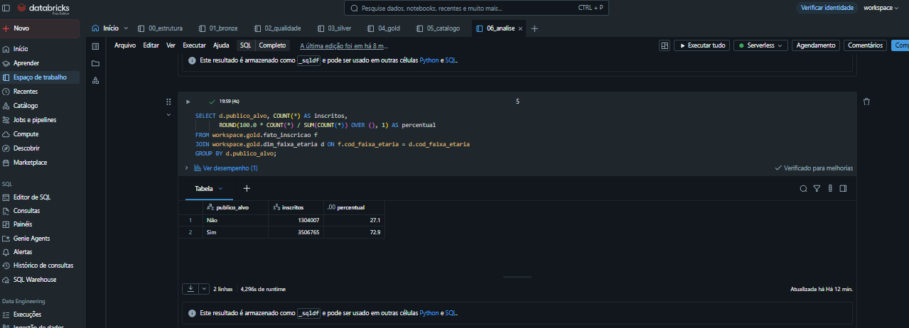

*Figura 45 – Antes da melhoria: legenda do público-alvo como "Sim/Não".*

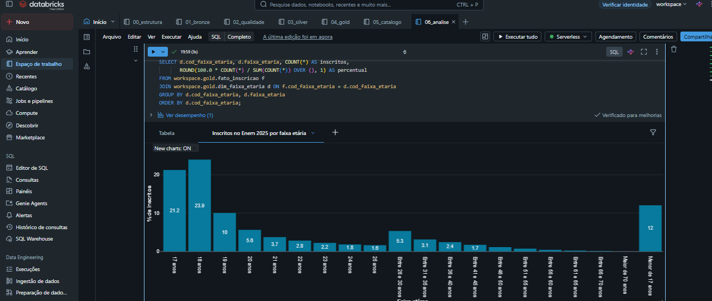

*Figura 46 – Antes da melhoria: gráfico de faixa etária em ordem alfabética.*

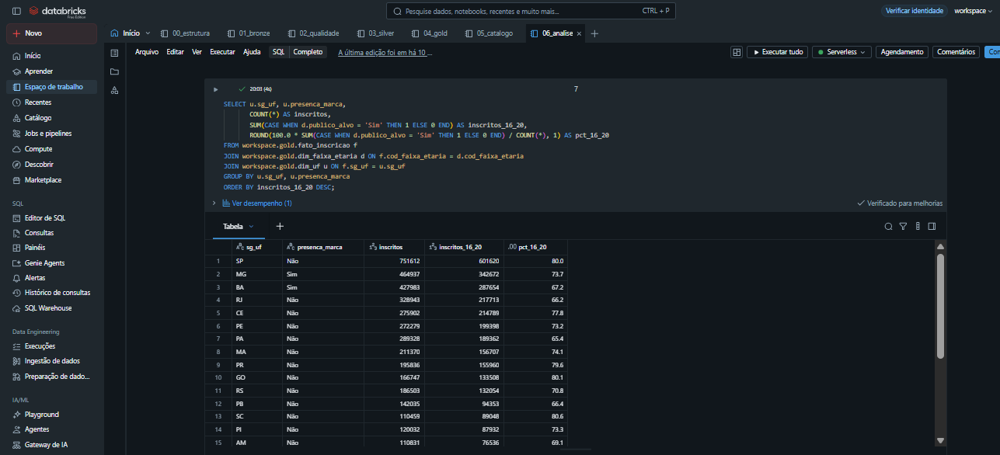

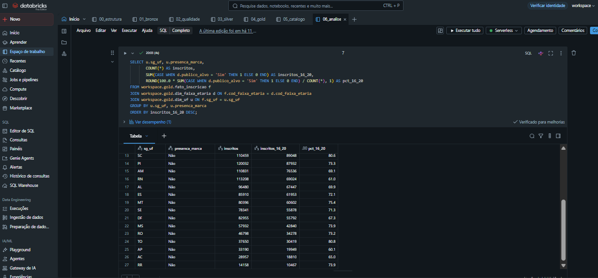

*Figura 47 – Antes da melhoria: pergunta 3 ordenada pelo volume de jovens (em duas partes).*

#### O que aprendi

Foi muito enriquecedor conhecer as possibilidades de construção de análises para além do dia a dia de dashboards simples de mídia. Em vez de olhar apenas para indicadores prontos, aprendi a partir do dado bruto, organizá-lo e cruzá-lo para testar hipóteses de negócio, como o tamanho real do público-alvo ou os mercados prioritários para uma campanha.

Do ponto de vista técnico, aprendi a construir um pipeline de dados de ponta a ponta na nuvem: carregar dados brutos, verificar a qualidade antes de transformar, organizar as camadas bronze, silver e gold, modelar um esquema estrela, documentar tabelas e colunas em um catálogo e usar SQL para responder a perguntas de negócio. Também aprendi que a qualidade dos dados e a disponibilidade das variáveis definem o que é possível responder, e que a clareza de uma tabela ou de um gráfico é tão importante quanto o número que ele mostra.

Na minha área, esse raciocínio pode apoiar decisões de planejamento de mídia, como a escolha de praças, o dimensionamento de públicos e a distribuição de verba entre canais, a partir de dados abertos e verificáveis.

#### O que eu faria diferente

- **Ler o dicionário de variáveis antes de fechar as perguntas.** A ausência da variável de tipo de escola só apareceu no meio do trabalho; com a leitura prévia, a pergunta 5 poderia ter sido ajustada desde o início.
- **Planejar o cronograma com mais folga**, considerando o tamanho dos microdados e o tempo de aprendizado da ferramenta.
- **Padronizar desde o início os nomes dos prints e das tabelas**, o que facilitaria a documentação final.
- **Começar com um escopo ainda menor e ampliar depois**, seguindo a própria lógica do MVP.

#### Trabalhos futuros

- Repetir a análise com os **microdados do Enem 2026**, quando forem publicados, e comparar a evolução do público.
- Usar a **Plataforma Sedap+ do Inep**, lançada em 2026, que permite consultas agregadas com proteção de privacidade, para cruzar o perfil dos inscritos com as notas.
- Buscar a informação de **rede de ensino (pública ou privada)** em fontes complementares, como o Censo Escolar, para responder à pergunta 5.
- Após a campanha, cruzar os **resultados da mídia impulsionada** (alcance e cliques por estado, informados pelas plataformas de anúncio) e os acessos rastreados por **links com UTM** com o perfil dos inscritos, para medir se as praças e os públicos priorizados responderam como o previsto.
- Transformar este projeto em uma **peça de portfólio** que una comunicação e dados, mostrando como dados públicos podem orientar o planejamento de mídia.

#### Avaliação geral

Mesmo com as limitações descritas, considero que o MVP cumpre o seu papel: o pipeline funciona de ponta a ponta, os dados estão documentados e as respostas trazem recomendações práticas para a campanha. Mais do que o resultado, este trabalho me deu confiança para seguir evoluindo na área de dados. Acredito que ele ainda pode ser melhorado com o que aprenderei nas próximas etapas do curso e com as boas práticas dos trabalhos dos colegas.

---

## Referências

- INSTITUTO NACIONAL DE ESTUDOS E PESQUISAS EDUCACIONAIS ANÍSIO TEIXEIRA (INEP). **Microdados do Enem 2025**. Brasília: Inep, 2026. Disponível em: https://www.gov.br/inep/pt-br/acesso-a-informacao/dados-abertos/microdados/enem. Acesso em: 24 set. 2026.
- INSTITUTO NACIONAL DE ESTUDOS E PESQUISAS EDUCACIONAIS ANÍSIO TEIXEIRA (INEP). **Microdados** (formato de divulgação e LGPD). Disponível em: https://www.gov.br/inep/pt-br/acesso-a-informacao/dados-abertos/microdados. Acesso em: 24 set. 2026.
- BRASIL. **Decreto nº 8.777, de 11 de maio de 2016**. Institui a Política de Dados Abertos do Poder Executivo federal. Disponível em: https://www.planalto.gov.br/ccivil_03/_ato2015-2018/2016/decreto/d8777.htm. Acesso em: 26 set. 2026.
- JORNAL DE BRASÍLIA. **Enem 2026 tem mais de 5 milhões de inscritos confirmados**. 3 jul. 2026. Disponível em: https://jornaldebrasilia.com.br/noticias/concursos-e-carreiras/enem-2026-tem-mais-de-5-milhoes-de-inscritos-confirmados/. Acesso em: 24 set. 2026.
- BAND. **Enem 2026: MEC confirma mais de 5 milhões de inscritos**. 3 jul. 2026. Disponível em: https://www.band.com.br/educacao/enem-2026-mec-confirma-mais-de-5-milhoes-de-inscritos. Acesso em: 24 set. 2026.
- PODER360. **Enem 2026 tem 5,05 milhões de inscrições confirmadas**. Disponível em: https://www.poder360.com.br/poder-educacao/enem-2026-tem-505-milhoes-de-inscricoes-confirmadas/. Acesso em: 26 set. 2026.
- DATABRICKS. **Databricks Free Edition limitations**. Disponível em: https://docs.databricks.com/aws/en/getting-started/free-edition-limitations. Acesso em: 24 set. 2026.
